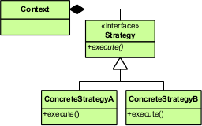
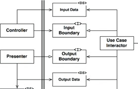

# Architectural boundaries

See:

- Clean Architecture (book by Robert C. Martin)
- Building Evolutionary Architectures (book by Neal Ford, Rebecca Parsons and Patrick Kua) ([summary slides](https://www.slideshare.net/thekua/building-evolutionary-architectures))
- [Conway’s Corollary](http://www.ianbicking.org/blog/2015/08/conways-corollary.html)
- [Our Software Dependency Problem](https://research.swtch.com/deps)

## Architecture is about boundaries

System's architecture defines shape of the system:

- How the system is divided into components
- How those components are arranged
- What kinds of boundaries exist between different components
- How components communicate across those boundaries

Not only technical components but also components within the codebase itself!

Boundaries separate parts of the system that shouldn’t know too much about each other

Benefits of this separation: flexibility!

- Lower coupling: Decouple components so changes in one component don't require changes in other components
- Higher cohesion: Group together things that change at the same rate and for the same reasons (cohesion)
  - Manifestation of the Single Responsibility Principle (from the [SOLID principles](./oo-design/SOLID-principles.md)), but this time at the architectural level
- Ability to delay choices until last possible moment
- Example: Separating main business logic from persistence logic
  - If the business logic doesn’t have any idea about the database we use (or potentially even the fact that we use a database), we have the flexibility to change the database that our system depends on without having to make any kind of changes to the main business logic
  - If we need to make changes to the main business logic that do not influence the kind of data that needs to be persisted, we can make those changes without the persistence code having to know anything about them
  - You could potentially build all of the business logic without connecting to a database, simply writing code against some persistence interfaces describing what kind of data you will need to store and retrieve, and thus delay the decision of which kind of database to use until you have a better idea of what you need from your persistence solution
- Example: Separating different functional areas from each other
  - Scaling! Can allow different functional parts of the system to be developed by different teams while keeping the required amount of coordination between teams manageable

Flexibility provided by boundaries is important, especially for maintenance (typically the most risky and expensive part). Often, the first version of a system making it to production is only the start, and most of the work will happen after that. Additional requirements will be added, existing functionality will need to be changed, and so on. Adequate boundaries will provide the necessary flexibility to make this kind of maintenance possible, allowing the system to grow without exponentially increasing the work needed to add or adjust a piece of functionality.

## Different kinds of boundaries

### Horizontal versus vertical separation

#### Horizontal slicing

- Boundaries between different technical areas (layers) of the system
- Example: a layer for the API, a layer the business logic and a layer for communicating with the database
- Benefit: allow for technological flexibility (for example, relatively easy to switch to other kind of DB)
- Drawback: single functional change is likely to affect multiple layers

#### Vertical slicing

- Boundaries between different functional areas of the system
- Example: functionality for managing customers can be separated from functionality for placing orders
- Benefit: Changes within a single functional domain can happen within a single part of the system
  - Especially helpful if different parts maintained by different teams!
  - Changes within a single functional domain can happen within a single team and coordination with other teams is only required if the communication with other functional domains needs changes as well
  - See [microservices](reference-architectures/Microservices.md), where different small teams each maintain one or more microservices that encapsulate a certain functional area across several layers of the technical stack, even down to the database

#### Conway's Law

Conway's Law is as follows:

> organizations which design systems are constrained to produce designs which are copies of the communication structures of these organizations

Such designs actually make sense as well: if changes within a single part of the system can happen within a single team, it’s way easier to plan and execute these changes

Consequence: if there is a mismatch between the team structure within your organization and the architecture of the application you’re working on, building the application is likely to be a struggle

You can use Conway’s Law to your advantage by structuring your application (and thus your teams) in such a way that changes to the system are pretty likely to be confined to a single part of the application. In practice, it seems that vertical slicing is typically the best way to do that.

### Separation mechanisms

#### Source-level boundaries

- Lowest-level boundaries
- Use mechanisms offered by the programming language (classes, interfaces, packages, modules, …)
- Communication through simple method calls
  - Fast, don't have to worry about amount of communication passing boundary
- Not visible at deployment time
  - Does not mean they are not important! When set up correctly, they can still help to isolate different parts of the system from each other in order to facilitate independent development by multiple persons or teams
- Only kind of boundary in monolithic systems

##### Abstraction

Use your language's abstraction mechanisms to separate clients from implementations

Example: [Strategy pattern](https://en.wikipedia.org/wiki/Strategy_pattern)



##### Encapsulation

Divide the code into modules where classes outside of a module can only see the classes that that module explicitly exposes

Examples in Java:

- Making classes package protected (limitation: Java does not have real notion of nested packages)

- The [Java Platform Module System](https://en.wikipedia.org/wiki/Java_Platform_Module_System)

If your language doesn't provide something like this, you may be able to set it up using linting rules or automated tests that analyze dependencies

##### Data transfer objects

When passing data between components, the components can be more decoupled if the objects crossing the boundary are simple data transfer objects instead of actual specific classes that are being used on either side

##### Combining the above

Example of combining the above: use case boundary as specified by the Clean Architecture



([image source](https://softwareengineering.stackexchange.com/questions/380251/clean-architecture-what-is-the-view-model))

- Abstraction, specifying interfaces for both client and provider
- Data transfer objects for input and output data
- Ideally, encapsulation is used to prevent clients from calling the implementation(s) of the input boundary interface directly

Also note that the Dependency Inversion Principle (from the [SOLID principles](./oo-design/SOLID-principles.md)) has been used to make sure all dependencies point from the component calling the use case to the use case component itself.

##### Simpler boundaries

An example of a simpler boundary is the [Facade pattern](https://en.wikipedia.org/wiki/Facade_pattern). Here, you take a complex subsystem and put it behind a class that exposes a nice interface to that subsystem. This does not provide the same amount of separation as the use of abstractions and does not allow you to control the direction of dependencies, but it can help with managing complexity and potentially prepare for the creation of a full boundary.


#### Dynamically-linked deployable components

- Parts separated by the boundaries are separately developable and deployable components
  - Example: DLL or JAR files
- Deployed independently, but they still run in the same address space
  - Communication still through simple method calls
- When different components are developed independently from each other, you need some kind of versioning and release management system that allows developers depending on a component to decide if and when to upgrade to its next version
- Dependencies between components need to be managed carefully in order to prevent dependency cycles
  - See Dependency Inversion Principle (from the [SOLID principles](./oo-design/SOLID-principles.md))

See also [Deployable components](./Deployable-components.md)

#### Local processes

- Separate parts deployed as local processes
- Still live on the same machine, but they do not share the same address space (unless some memory sharing involved)
  - Inter-process communication through shared memory, sockets or potentially some OS-specific mechanisms
  - Context switching between processes (and potential marshalling and unmarshalling) means that the communication between processes has more overhead than just simple method calls. Where possible, unnecessary back-and-forth should be avoided.

#### Services

- Strongest, highest-level boundary
- Different services are assumed to live on different machines and communicate only over the network
  - Communication often happens over HTTP or some kind of message queue
  - Communication between services is expensive from a performance point of view
- Each service typically developed and operated by a separate team that takes ownership of the service, including its tech stack and data
  - Sharing of a database between services is generally considered bad practice, because it prevents services from independently making changes to their database structure (or independently choosing the database technology which makes the most sense for the service)
- Freedom and flexibility: Ideally, changes to a service, except for its communication with other services, do not have any effect on other services
- Still some coupling! The fact that services communicate with each other means that services will still depend on each other to some extent
  - Example: If your service needs customer data, there are scenarios where a change to the Customer service could impact you.
  - These dependencies should be carefully managed

See also [Microservices](reference-architectures/Microservices.md)

### Combining different kinds of boundaries

There is no need to choose only one kind of boundary! Different kinds of boundaries can be useful at different levels of your architecture.

Example: You could have a set of microservices which you have obtained using vertical slicing. However, each of those microservices could have a layered architecture using horizontal slicing to separate different technical parts, either through source-level boundaries or as separately deployable components.

## The costs of boundaries

Benefits of boundaries do not come for free!

- Potentially some performance impact
- Most costly impact: development and maintenance effort!
  - Boundaries need to be developed and maintained
  - Boundaries' decoupling mechanisms can increase the complexity of the system as a whole

If you have five teams working on a system, they will likely benefit from having five clearly separated parts with stable interfaces connecting them. The same architecture could be harmful to productivity if there is only a single small team working on the system. The experience and knowledge of different team members also plays a part. 

When in doubt, keep it simple! 

- If there is no clear need for a boundary, it is likely that adding the boundary would be a case of over-engineering.
- Already plenty of horror stories about systems with so many layers of abstraction that it is almost impossible to figure out where certain logic sits in the codebase or where a certain new feature should be implemented

Main conclusion: You have to make a tradeoff between the benefits and costs of each boundary instead of just blindly introducing boundaries and abstraction everywhere

## Evolving boundaries

Deciding on boundaries requires careful consideration:

- Boundaries are expensive
- Introducing a new boundary which was not there before is typically very expensive

However, it is impossible to know everything beforehand when building a system:

- Context and requirements for the system are likely to change throughout its lifetime
- Likely impossible to foresee all technical challenges

This means that the architecture of the system and the boundaries defining it will need to evolve along with the system itself.

Some things that may need to evolve:

- The location of the boundaries
  - It’s possible that, as the system and the team grows, additional boundaries are needed to be able to maintain productivity
  - On the other hand, the cost of maintaining certain boundaries may no longer outweigh the benefits they bring
- The separation mechanism used by a boundary
  -  An application could start as a monolith with some well-placed source-level boundaries, but over time it could make sense to start breaking up different parts into separate components or even separate services
  - Ideally, a boundary should allow you to move to a higher (or lower) level of separation without the majority of the code having to know anything about the change

A good architect will keep on watching the system for signs of parts that need additional separation or boundaries that have become less relevant. They will then make the necessary adjustments, taking into account both the benefits and costs associated with changing boundaries. This way, the architecture of the system will keep on evolving to suit the needs of the system and team.

## Boundaries and the database

### Boundaries between the domain and the database

Typically makes sense to draw a boundary between the actual domain logic and the database (unless your application is a thin layer around the database that doesn’t really have any domain logic)

One widespread convention: *Repository* pattern:

- All interaction with the database is encapsulated inside Repository classes
- The domain logic interacts with these classes, without having to know anything database-specific

```java
interface UserRepository {
    getUsers(): Promise<User[]>;
    getUser(id: string): Promise<User>;
    saveUser(user: User): Promise<void>;
    deleteUser(id: string): Promise<void>;
}

class SqlServerUserRepository implements UserRepository {
    // implement UserRepository methods by talking to SQL Server
}

class UserService {
    constructor(private repository: UserRepository) { }

    async updateName(id: string, newName: string) {
        const user = await this.repository.getUser(id);
        user.setName(newName);
        await this.repository.saveUser(user);
    }
}
```

If the domain logic is using the repository interface, then it also becomes easy to swap out the `SqlServerUserRepository` for a different implementation, for example an in-memory repository for testing purposes.

```java
class InMemoryUserRepository implements UserRepository {
    // implement UserRepository methods using in-memory storage
}
```

### Separation at the database level

For larger systems, it can make sense to separate different parts of the application down to the database level. Each part uses different tables or a different database, with no links between data belonging to different parts. This kind of separation is considered good practice when setting up a microservices architecture. You can also do this in monolithic applications, potentially as a stepping stone towards a feature microservices architecture.

Separation at the database level makes it easier to reason about separate parts of the application without having to think about other parts. It also provides more flexibility to change the schema or database technology for a certain part of the system.

When drawing boundaries down to the database level, some data that is relevant to two parts of the system might exist on both sides of the boundary between them

See also [Microservices](reference-architectures/Microservices.md)

## Boundaries and the web

### Decoupling the domain from the web

One boundary that almost always makes sense to draw is the separation between your domain and the actual user interface that the user interacts with

Typical to see `Controller` classes (some other terms are used as well) that take care of the interaction with the user and delegate all real work to the code implementing the actual business logic

In principle, none of your business logic should be aware of how it is shown to the user, including whether or not the UI is a web UI!

### Different representations of objects

Different parts of the system have different goals -> they may also need different representations of the same object!

- When doing server-side rendering, it often makes sense to have a separate view model that simply holds the data to be shown
  - Data in the view model could be a transformed version of the data obtained from the domain model (e.g. formatting a date) or could aggregate data from several domain objects
- Data returned from the API could have a different format or structure than the actual domain objects inside the business logic part of the application
  - Ideally, the data returned from APIs (or expected by APIs) will be aligned with what the consumers of the API care about
- If your frontend is a single-page application getting data from the backend over an API, feel free to create separate representations of that data that are more comfortable for the rest of the frontend to work with
  - Backend is mostly about having consistent information regarding the objects in the system, while frontend is mostly about providing the user with an easy way of interacting with those objects

### Micro frontends

Even in a microservices architecture, it is typical to have a backend consisting of several microservices but a single monolithic frontend on top of it

An alternative are micro frontends, where the frontend is stitched together from multiple independently maintained parts. See [Microservices](reference-architectures/Microservices.md).

## Boundaries and libraries/frameworks

Take care not to let too much of your code depend on third-party code!

- External dependencies evolve in a way you do not control
  - Their newest version including some critical bugfixes may introduce breaking changes in an API you use or even remove the functionality you use
  -  They may stop being properly maintained
- Your own requirements relevant to the dependency may change
- All of this can force you to change the way you use the dependency or even replace it with another dependency

Consider creating a boundary around the external dependency that decouples the rest of the system from it (this boundary is sometimes called an *Anti-Corruption Layer*):

- The public interface of that boundary should be written in terms of what your system needs from the dependency
- Logic inside the boundary will be specific to the interaction with that particular dependency. 
- Benefits:
  - If the API of the dependency changes or you replace it, the boundary protects you from having to change all code that used the dependency. As long as you can fulfill the contract specified by the public interface of the boundary, no code outside of the boundary has to be aware of the change.
    - Especially useful if you consider the dependency to be a temporary solution that is sufficient for now but will most likely need to change in the future. The boundary allows you to avoid premature complexity by going for a simple solution, while keeping your options open regarding the upgrade to a more complex solution.
  - You can also use the boundary to create some automated tests for the specific functionality that your system needs to get from the boundary. By testing against the boundary, you don’t have to change your tests in order to be able to test a new version of the dependency or even a replacement.

Be extra careful when dealing with frameworks!

- Frameworks tend to dictate the structure of your application and may even ask you to base your domain objects on the abstractions they provide. If you allow this, it will be very difficult to get the framework out afterwards. 
- Could help to let the framework operate on some kind of separate representation of your domain objects instead of the domain objects themselves. Your boundary could then take care of performing the necessary translations between that separate representation and the actual domain objects.

## Boundaries and duplication

### False duplication

Watch out for *false duplication*!

- Real duplication: duplicates always have to change together
  - This is what the DRY (Don’t Repeat Yourself) principle wants you to avoid
- False duplication: code/structures/... that are identical now but likely to change at different times or for different reasons
  - Common with vertical slicing, where certain functionalities may start out looking similar but end up diverging significantly
  - Can also happen with horizontal slicing, for example the apparent duplication between a database row and the corresponding structure we send to the UI
    - It may be tempting to pass the database row directly to the UI, and in some cases this can be a good idea, but it isn’t hard to imagine that the structure of the data to show in the UI and the structure of the data in the DB could have to change independently of each other
  - The fact that two things are the same at this moment does not necessarily mean that they are real duplicates and that that apparent duplication is a bad thing
  - Attempts to get rid of false duplication tend to lead to unnecessary coupling through shared code, which will then come back to bite you when the “duplicates” suddenly need to change independently of each other

### Data duplication and bounded contexts

See [Microservices](reference-architectures/Microservices.md)

