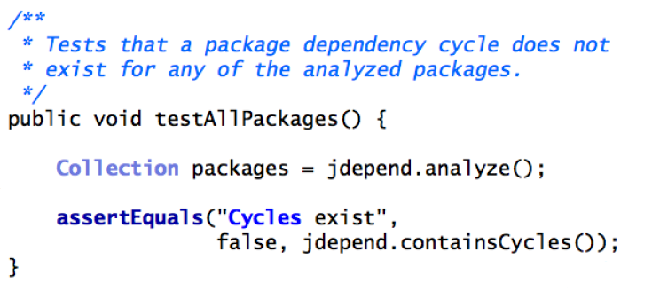
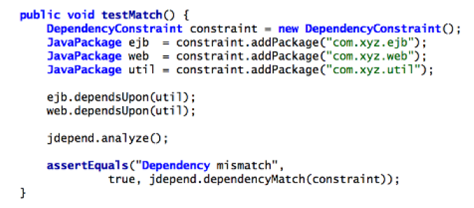

# Architectural fitness functions

## Contents

-   [Basic idea](#basic-idea)
-   [Categorizing fitness functions](#categorizing-fitness-functions)
    -   [Atomic versus holistic](#atomic-versus-holistic)
    -   [Triggered (batch) versus continuous](#triggered-batch-versus-continuous)
    -   [Static versus dynamic](#static-versus-dynamic)
    -   [Automated versus manual](#automated-versus-manual)
    -   [Temporal](#temporal)
-   [Example fitness functions](#example-fitness-functions)
    -   [Atomic and triggered](#atomic-and-triggered)
    -   [Holistic and triggered](#holistic-and-triggered)
    -   [Atomic and continuous](#atomic-and-continuous)
    -   [Holistic and continuous](#holistic-and-continuous)
-   [Resources](#resources)

## Basic idea

Architectural fitness functions:

-   allow us to evaluate to what extent our architecture has the properties we want it to have
-   assess goals like performance, reliability, security, operability, coding standards, ...
    -   focus on what is really important for the specific system based on business requirements, technical capabilities, scale, ...
        -   this also means not spending tome and money on things that are not really important!
    -   for every system, a crucial early architecture decision is to define the most important dimensions (scalability, performance, security, ...) to take into account
        -   can help to prioritize riskier work to get the risky stuff out of the way as soon as possible
        -   can lead to an architecture that makes certain concerns explicit instead of having them scattered across the codebase
        -   this can still evolve! some fitness functions will emerge during development of the system
-   provide guidance in evolving our architecture
    -   help finding areas that need improvement
    -   evaluate how certain changes affect how well the architecture satisfies our goals
    -   allow us to make tradeoffs between different goals if needed

## Categorizing fitness functions

### Atomic versus holistic

Atomic fitness functions:

-   test one particular aspect of the architecture
-   example: unit test checking for cyclic dependencies in a certain package

Holistic fitness functions:

-   test a combination of architectural aspects
-   useful for assessing the interactions between different architectural concerns
-   lots of combinations possible, need to focus on most important ones
-   example:
    -   security: evaluate staleness of data
    -   scalability: number of concurrent users within a certainly latency range
        -   developers make this work by implementing caching, but this influences staleness of data
    -   very helpful to have a fitness function that tests for staleness of data with the caching enabled

### Triggered (batch) versus continuous

Triggered fitness functions:

-   executed in response to some particular event
-   examples:
    -   a developer executing a unit test
    -   a QA person performing exploratory testing

Continuous fitness functions:

-   perform constant verification of architectural aspects
-   example: monitoring
    -   [Monitoring-Driven Development](https://nl.devoteam.com/en/blog-post/monitoring-driven-development-making-money/)
    -   [Monitoring Check Smells](https://benjiweber.co.uk/blog/2015/03/02/monitoring-check-smells/)

### Static versus dynamic

Static fitness function:

-   fixed predefined acceptable values: binary, a certain number range, ...
-   example: binary pass/fail of a unit test

Dynamic fitness function:

-   acceptable values depend on context
-   example: acceptable latency might depend on actual scale of the system

### Automated versus manual

Automated fitness function:

-   automated unit tests, deployment pipelines, stress tests, ...
-   ideally as much automation as possible!

Manual fitness functions:

-   some things impossible to automate, for example when certain changes need manual approval for legal reasons
-   some things may not be properly automated yet, for example QA
-   for some tests, it might be more efficient to determine success/failure manually

### Temporal

Temporal fitness functions:

-   have a particular time component
-   example: temporal fitness function as a reminder to check to see if important security updates have been performed

## Example fitness functions

### Atomic and triggered

Typically run by developers and in deployment pipeline

Example: automated tests that check the [cyclomatic complexity](https://en.wikipedia.org/wiki/Cyclomatic_complexity) of the code

Example: automated tests checking for dependency cycles

Example: automated tests checking the direction of package imports

([image source](http://nealford.com/downloads/Evolutionary_Architecture_Keynote_by_Neal_Ford.pdf))

### Holistic and triggered

Typically run by developers and in deployment pipeline

Example: testing what kind of impact tighter security has on scalability

### Atomic and continuous

Run as part of the deployed architecture

Example: monitoring

Example: logging

### Holistic and continuous

Run as part of the deployed architecture

Example: Netflix's [Chaos Monkey](https://github.com/netflix/chaosmonkey)

-   designed to test resilience to instance failures
-   runs in production and randomly terminates instances
-   forces teams to build resilient services while still taking into account other architectural goals

## Resources

-   Building Evolutionary Architectures (book by Neal Ford, Rebecca Parsons and Patrick Kua) ([summary slides](http://nealford.com/downloads/Evolutionary_Architecture_Keynote_by_Neal_Ford.pdf))
