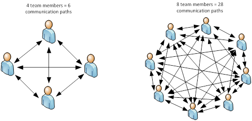

# Architecture and people

## Contents

-   [Team size and communication paths](#team-size-and-communication-paths)
-   [Conway's law](#conways-law)
-   [Experience and preferences](#experience-and-preferences)
-   [Code ownership](#code-ownership)
-   [Technical/architectural governance](#technicalarchitectural-governance)
-   [Resources](#resources)

## Team size and communication paths

([image source](https://flow-state.blogspot.com/2012/01/importance-of-small-team-size.html))

-   Number of distinct communication paths blows up as team size grows
-   As team grows, this leads to either large communication overhead or suboptimal communication
    -   Including everyone in synchronous communication can be a waste of people's time
    -   Excluding people from synchronous communication means some people will miss information
        -   Information that is not relevant at the time might become relevant later
    -   Asynchronous communication can help
        -   Written documentation, meeting recordings, small videos demonstrating certain things, ...
        -   Can be referenced when needed
        -   Can't fully replace synchronous communication
        -   It takes longer to properly write something down or record it than to discuss it synchronously
        -   It might be challenging to find what you need in the archive of documents, recordings, ... (or to even know it exists)
    -   Group chat (without explicitly tagging people) sits somewhere between synchronous and asynchronous communication
        -   People can in principle read messages when it suits them, but discussion might already be over by then
        -   Important stuff can get buried under other discussions
-   Bigger teams will have bigger scope will thus need to juggle more information to begin with

Related: **Brook's law**

> adding manpower to a late software project makes it later

-   Adding someone new to a project means increased communication overhead _and_ people being forced to spend their time on getting the new person to a point where they can provide positive net value (which might not happen before the end of the project)
-   If communication overhead is the main issue, it could actually help to _remove_ people from the project
    -   In addition to general communication overhead, there is a limit to the extent to which work be parallelized without actually having a _negative_ impact on delivery time because of required alignment, code conflict resolution, context switching because people are blocked by each other, ...

All of this pushes towards smaller teams or smaller sub-teams within a bigger team

-   Famous example: Amazon's "two-pizza teams", aiming at max 4-7 people per internal team

## Conway's law

Conway's law:

> organizations which design systems are constrained to produce designs which are copies of the communication structures of these organizations

For example, if 4 teams need to design a system together, the designed system is likely to consist of 4 clearly-separated parts each owned by one team

Why this happens:

-   Communication bandwidth _within_ a team is much larger than communication bandwidth _between_ teams
-   This drives teams towards an architecture that minimizes required alignment between teams
    -   Well-defined components with clear scope
    -   Well-defined, stable boundaries between the components

Examples of team structure influencing system architecture:

-   Teams split across significantly different time zones (small workday overlap) tend to gravitate towards system split into different parts, one owned by each time zone
-   If every component in a multi-component system is maintained by one and the same team, the components are likely to be tightly coupled
-   If every component in a multi-component system is maintained by a different team, the components are likely to be loosely coupled (having them tightly coupled would make it too painful to get things done)

Some consequences:

-   Mismatch between team structure and architecture = pain
    -   If your current architecture matches your team structure and you then change team structure, your current architecture will work against you
-   Mismatch between team structure and shape of changes = pain
    -   Having separated frontend, backend and DB teams can be a real pain if almost every required change touches all layers

**Inverse Conway maneuver**: start from the architecture you want to achieve for a new system and design teams based on that

-   Example: Netflix pushed for focused, independent teams from the beginning as a way to ensure that their system would be made up of focused, loosely coupled services

## Experience and preferences

People's experience and preferences need to be taken into account when designing system's architecture!

-   Some levels of architectural complexity might be too much for the team's current capabilities and experience level
-   Stressed or frustrated people are unproductive and likely to leave

Example: Imagine team of 15 people working on system with 5 isolated parts requiring roughly same amount of development

-   Would you split this into 5 full-stack teams of 3 people each?
-   What if only 3 of your developers know frontend and none of the backend developers want to learn frontend?

## Code ownership

-   Ideally, every piece of code is owned by exactly one small team
-   Avoid having a library/service shared and maintained by multiple teams together
    -   High overhead from inter-team communication
    -   Less efficient alignment = higher potential that change by one team will break things for others
    -   Alternative that could help: **internal open source**
        -   One team really owns the code (comparable to maintainers of a regular open source project)
        -   Other teams can create issues and submit pull requests, but those need to be reviewed by owning team
        -   Still quite some overhead, reviewing effort might be high, ...

## Technical/architectural governance

How to make people follow coding style, architectural rules, ...?

-   Make sure everybody understands the rules
    -   Write them down, teach them to new hires, ...
-   Bonus points if people are involved in the creation of the rules
-   Automate!
    -   See also [Pragmatism and imperfectionism - Make success easier than failure](../mindset/Pragmatism-imperfectionism.md#make-success-easier-than-failure)

## Resources

-   [The Importance of Small Team Size](https://flow-state.blogspot.com/2012/01/importance-of-small-team-size.html)
-   [Applying Brooks' Law to Lines of Communication and Team Size](https://dzone.com/articles/applying-brooks-law-to-lines-of-communication-and)
-   Building Microservices (book by Sam Newman)
-   Building Evolutionary Architectures (book by Neal Ford, Rebecca Parsons and Patrick Kua) ([summary slides](http://nealford.com/downloads/Evolutionary_Architecture_Keynote_by_Neal_Ford.pdf))
-   [Conway’s Corollary](http://www.ianbicking.org/blog/2015/08/conways-corollary.html)
