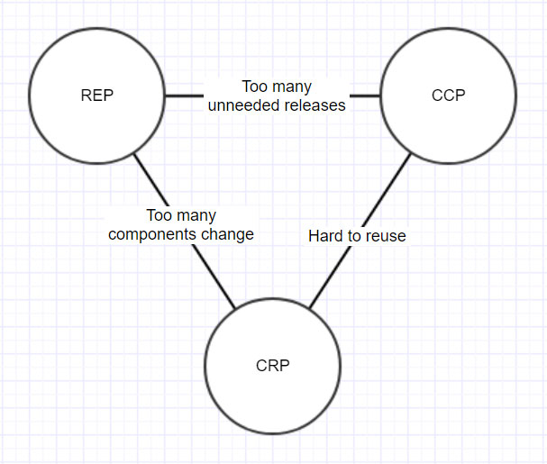

# Deployable components

## Contents

-   [Basic idea](#basic-idea)
-   [Component cohesion](#component-cohesion)
-   [Component coupling](#component-coupling)
    -   [Acyclic Dependencies Principle](#acyclic-dependencies-principle)
        -   [Breaking cycles](#breaking-cycles)
    -   [Stability and volatility](#stability-and-volatility)
        -   [Stable Dependencies Principle](#stable-dependencies-principle)
        -   [Stable Abstractions Principle](#stable-abstractions-principle)
-   [Evolving the component structure](#evolving-the-component-structure)
-   [Resources](#resources)

## Basic idea

Deployable components: 

-   Think JAR files, DLL files, npm packages, ...
-   Smallest parts that can be developed, versioned and deployed independently
-   Broad definition of "deployed independently"
    -   Could be independently deployed as some kind of dynamically loaded plugins
    -   Could be aggregated into single archive (example: .war file)
    -   Could get linked into single executable
    -   Example: Executable is built from component A, B and C where both A and B depend on C. Component C is in full development, with new versions being released all the time. However, it's possible to keep using an older version of C in the executable until A and B are adjusted to support the newest version of C.

## Component cohesion

Answer to the question "which classes belong in which components?"

Three important principles:

-   **REP:** Reuse-Release Equivalence Principle
    -   "The granule of reuse is the granule of release"
    -   Classes and modules within a release should be releasable together
        -   There must be some overarching theme or purpose that everything within a release shares
        -   The fact that classes and modules in a release share the same version numbering and same release documentation should make sense to both the author and the users
    -   Releases of shareable software components/modules must produce the proper notifications and release documentation
        -   Version numbers are important for measuring compatibility and for communicating changes
        -   See also [Semantic Versioning](https://semver.org/)
            -   breaking.new-features.fixes
    -   This principle is inclusive: tends to make components larger
-   **CCP**: Common Closure Principle
    -   "Components should consist of classes that change for the same reason and at the same times"
        -   Similar to Single Responsibility Principle in [SOLID principles](oo-design/SOLID-principles.md)
    -   If the code of an application must change, you would ideally have all the changes to occur in a single component, so you only have to redeploy that single component
        -   Other components depending on that single component do not need to be revalidated or redeployed
    -   Relation to Open-Closed Principle from [SOLID principles](oo-design/SOLID-principles.md): group together the classes that are closed to the same type of changes
    -   This principle is inclusive: tends to make components larger
-   **CRP**: Common Reuse Principle
    -   "Don’t force users of a component to depend on things that they don’t need"
        -   Similar to Interface Segregation Principle from [SOLID principles](oo-design/SOLID-principles.md)
    -   If your component has a dependency on another component, any time that depended upon component is changed, your component will need to be revalidated/recompiled
        -   This is true even if you don't care about the changes in that depended upon component
    -   Try to make sure that the classes in a component are inseparable, that it is almost impossible to depend on some but not on the others
    -   This principle is exclusive: tends to make components smaller

These three tend to pull the answer to "which classes belong in which components?" in different directions

Tension diagram (edges of diagram show the cost of abandoning the principle on the opposite vertex):

([image source](https://www.codingblocks.net/podcast/clean-architecture-components-and-component-cohesion/))

-   Are “too many” components changing at the same time? Then your classes should be consolidated better (CCP)
-   Do you have “too many” releases? You should take a look at streamlining and minimizing your dependencies (CRP)
-   Is your code hard to re-use? You should improve your release artifacts (release numbers, documentation, notifications) (REP)

> “A good architect finds a position in that tension triangle that meets the _current_ concerns of the development team, but is also aware that those concerns will change over time.” – Robert C. Martin

## Component coupling

This is about the coupling that is caused by dependencies between components

### Acyclic Dependencies Principle

"When you draw a diagram of your components, using arrows to indicate dependencies, you should not have any cycles in that graph - the graph should be a Directed Acyclic Graph (DAG)"

If the graph is indeed a DAG, it is easy to find out which components could be affected by a change in a certain component: just follow the dependency arrows backwards. Additionally, you can easily find a "topological ordering" for the graph which gives you the order in which to build the components so every component's dependencies are built before the component itself needs to be built.

If you have a cycle, then the components in that cycle are not really independently developable and deployable!

-   People working on these components must make sure that the components stay compatible in both directions
    -   If A -> B -> C -> A, any new version of A must be compatible with a version of C which is compatible with that new version of A
    -   Loss of freedom regarding when to update to new versions of dependencies
    -   Breaking changes require careful coordination
-   Difficult to test your component in isolation because your dependencies also depend on the changes you make
-   Depending on your build system, circular dependencies between components might make it hard or even impossible to actually build the components
    -   If you need a built version of all your dependencies before you can build your component, you get a chicken and egg situation where your component cannot be built before building its dependencies but your dependencies can also not be built before building your component
-   Essentially, components in the cycle are reduced to a single component

#### Breaking cycles

Example cycle: A -> B -> C -> A

Two primary mechanisms:

-   Applying the Dependency Inversion Principle from [SOLID principles](oo-design/SOLID-principles.md) to invert the direction of dependencies
    -   Example: Reverse dependency between A and C so we now have C &lt;- A -> B -> C
-   Creating a new component that two components can depend on instead of one depending on the other
    -   Example: Create new component D that A and C depend on so we now have D &lt; - A -> B -> C -> D

See also [Circular dependencies](./Circular-dependencies.md)

### Stability and volatility

-   Some components will be _volatile_: intended and expected to change
    -   Example: user interface
-   Other components will be _stable_: intended and expected not to change (or not often)
    -   Example: core business logic

Stability is closely related to the structure of dependencies!

-   If a component does not depend on any other components but several other components depend on it, it is likely to be stable
-   No dependencies on others: not forced to change by others
-   Others depending on the it: changes to the component require a lot of work because others likely need to be adjusted accordingly
-   Special case common in statically typed languages: abstract components that contain nothing but some interfaces, don't depend on anything but are highly depended upon by others
-   If a component depends on several other components but no other components depend on it, it is likely to be volatile
    -   Depends on several others: each of those others can force it to change
    -   No others depending on it: free to change without affecting others

Possible metric for stability: # outgoing dependencies / (# incoming dependencies + # outgoing dependencies). Value is 0 if maximally stable, 1 if maximally volatile.

#### Stable Dependencies Principle

"You should depend on more stable components, not on more volatile ones"

-   If stable component depends on a volatile one, this means that the volatile one is expected to change often, which will force the stable component to become volatile as well
-   If you design a component to be easy to change (volatile), all your efforts to make change easy become undone once someone starts depending on your component

#### Stable Abstractions Principle

"More stable components should also be more abstract components"

Here, "abstractness" could be defined as the ratio of the number of classes in the component versus the number of those classes that are abstract classes or interfaces. Value = 0 if all concrete, 1 if all abstract.

Reasoning:

-   The problem: It makes sense to have core business logic in a stable component that several others depend upon. However, the fact that it's hard to change could make overall architecture inflexible. How do we make a stable component flexible enough to change?
-   The solution: use the Open-Closed Principle (from [SOLID principles](oo-design/SOLID-principles.md)) to create classes that are flexible enough to be extended without needing modification
    -   Originally aimed at inheritance, making classes easily extensible, which can often lead to making them abstract or even just defining an interface instead of a class
    -   Note: inheritance is not the only way to make a class extensible! We could also make the class support different kinds of behavior by passing in different objects (dependency injection, Strategy pattern). However, in that case, the objects to pass in will likely be specified by interfaces defined inside the component, again making the component more abstract.

## Evolving the component structure

Component structure doesn't need to reflect the different functional areas of the system! Instead, it reflects the buildability and maintainability of the application.

Likely, top-down design of component structure will not work well!

What typically works:

-   As the application grows, identify parts of the codebase where putting them in separate components would make development and maintenance easier
-   Want to keep changes as localized as possible, so start paying attention to CCP
-   As application continues to grow, more concern over creating reusable elements -> CRP
-   As cycles appear, apply ADP, changing dependency directions or creating new components

## Resources

-   Clean Architecture (book by Robert C. Martin)
-   [Clean Architecture – Components and Component Cohesion](https://www.codingblocks.net/podcast/clean-architecture-components-and-component-cohesion/)
