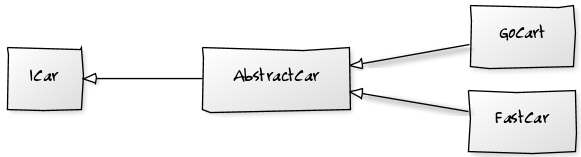
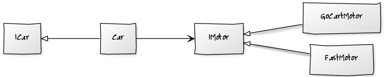
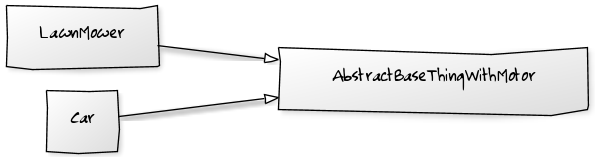
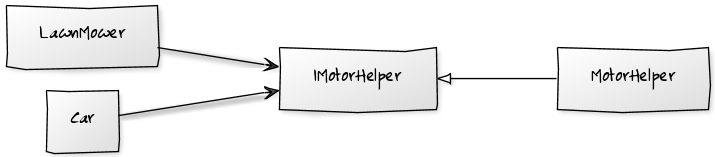

# Composition over inheritance

## Contents

-   [Basic idea](#basic-idea)
-   [Example: paying employees](#example-paying-employees)
-   [Special case: avoiding abstract base classes](#special-case-avoiding-abstract-base-classes)
    -   [Solution For 1 - Strategy Pattern](#solution-for-1---strategy-pattern)
    -   [Solution For 2](#solution-for-2)
-   [Resources](#resources)

## Basic idea

-   Try to achieve polymorphic behavior and code reuse by composing objects out of other objects rather than through building inheritance hierarchies
-   Prefer "has a " relationships over "is a" relationships
-   "Favor complex network of simple objects over a simple network of complex objects." (from [How to unit test abstract classes: extend with stubs?](https://stackoverflow.com/questions/243274/how-to-unit-test-abstract-classes-extend-with-stubs))

Approach:

1.  Identify areas of behavior
2.  For each area of behavior, create a component that implements that behavior
    -   You could have several alternative implementations with a common interface
3.  A class using these behaviors will hold references to components implementing the behavior and will delegate to them when that behavior is required (or simply have clients operate on those components directly)

Drawbacks of inheritance:

-   Inheritance hierarchies are inflexible
    -   Typically, a class can only inherit from one superclass
    -   Typically, you cannot change what superclass(es) a class inherits from at runtime
-   Building good inheritance hierarchies is hard
    -   See [SOLID principles - Liskov substitution principle (LSP)](./SOLID-principles.md#liskov-substitution-principle-lsp)
    -   Multiple inheritance is tricky ([The diamond problem](https://en.wikipedia.org/wiki/Multiple_inheritance#The_diamond_problem))
-   Inheritance can make the code harder to understand
    -   In complex inheritance hierarchies, the behavior of a class can be the combination of behavior defined at different levels of the inheritance hierarchy (with potential method overriding at any level), potentially making it very hard to understand how the class operates
-   Inheritance makes code hard to test
    -   It's hard to test the behavior of a subclass in isolation from the behavior of its superclass

Benefits of composition:

-   When using composition, it's easy to swap out a component for an alternative version of that component, even at run time!
-   Often, networks of simple objects (what we get when applying composition) are easier to understand than big inheritance hierarchies
    -   It's easy to isolate a specific part of the behavior by looking at what a specific component looks like
-   When using composition, it's easy to test components in isolation

Note: this doesn't mean that you should never use inheritance! 

-   In some cases it makes sense, either as a permanent solution or as a temporary solution to make things work before adding more complexity
-   However, still treat composition (not inheritance) as your default option

## Example: paying employees

With inheritance:

```java
public abstract class Employee {
    private int id;
    private String name;
    protected int hoursWorkedThisPeriod;

    protected int payRate; // pay per hour if hourly, salary per period if salaried

    public abstract int calculatePayout();
}

public class HourlyEmployee extends Employee {
    @Override
    public int calculatePayout() {
        return this.hoursWorkedThisPeriod * this.payRate;
    }
}

public class SalariedEmployee extends Employee {
    @Override
    public int calculatePayout() {
        return this.payRate;
    }
}
```

With composition:

```java
public abstract class Employee {
    private int id;
    private String name;
    private int hoursWorkedThisPeriod;

    private Contract contract;

    public int calculatePayout() {
        return this.contract.calculatePayout(this.hoursWorkedThisPeriod);
    };
}

public interface Contract {
    public int calculatePayout(int hoursWorkedThisPeriod);
}

public class HourlyContract implements Contract {
    private int hourlyRate;

    @Override
    public int calculatePayout(int hoursWorkedThisPeriod) {
        return this.hourlyRate * hoursWorkedThisPeriod;
    }
}

public class SalariedContract implements Contract {
    private int salary;

    @Override
    public int calculatePayout(int hoursWorkedThisPeriod) {
        return this.salary;
    }

}
```

Comparison between the two approaches:

-   In the implementation using composition, we can create dedicated, clearly named variables for hourly rate and salary and only use the relevant one
-   If a person switches from hourly to salaried, the implementation using composition allows us to just replace the `HourlyContract` by a `SalariedContract`, without touching any of the common employee data. In the implementation using inheritance, we would need to create a new `SalariedEmployee` and copy over all of the common employee data from the earlier `HourlyEmployee` object
-   It's likely that the salary type is not the only distinguishing property of an employee. For example, we can have normal employees and managers, or we can have permanent and temporary employees. If these kinds of employees could be either hourly or salaried, it's impossible to represent this using inheritance (unless we can use multiple inheritance). In any case, the implementation using composition is way more flexible when it comes to handling new features and new kinds of employees
-   If the contracts become complex, having them as separate dedicated `Contract` implementations makes it a lot easier to understand them
-   The implementation using composition makes it easy to test the different contracts in isolation, without needing to care about other aspect of employees

## Special case: avoiding abstract base classes

(taken from [How to unit test abstract classes: extend with stubs?](https://stackoverflow.com/questions/243274/how-to-unit-test-abstract-classes-extend-with-stubs))

There are two ways in which abstract base classes are used.

1.  You are specializing your abstract object, but all clients will use the derived class through its base interface.
2.  You are using an abstract base class to factor out duplication within objects in your design, and clients use the concrete implementations through their own interfaces.

### Solution For 1 - Strategy Pattern



If you have the first situation, then you actually have an interface defined by the virtual methods in the abstract class that your derived classes are implementing.

You should consider making this a real interface, changing your abstract class to be concrete, and take an instance of this interface in its constructor. Your derived classes then become implementations of this new interface.



This means you can now test your previously abstract class using a mock instance of the new interface, and each new implementation through the now public interface. Everything is simple and testable.

### Solution For 2

If you have the second situation, then your abstract class is working as a helper class.



Take a look at the functionality it contains. See if any of it can be pushed onto the objects that are being manipulated to minimize this duplication. If you still have anything left, look at making it a helper class that your concrete implementation take in their constructor and remove their base class.



This again leads to concrete classes that are simple and easily testable.

## Resources

-   [Composition over inheritance](https://en.wikipedia.org/wiki/Composition_over_inheritance)
-   [Prefer composition over inheritance?](https://stackoverflow.com/questions/49002/prefer-composition-over-inheritance)
-   [Polymorphism case study - Design pattern for morphing?](https://softwareengineering.stackexchange.com/questions/408246/polymorphism-case-study-design-pattern-for-morphing)
-   [How to unit test abstract classes: extend with stubs?](https://stackoverflow.com/questions/243274/how-to-unit-test-abstract-classes-extend-with-stubs)
