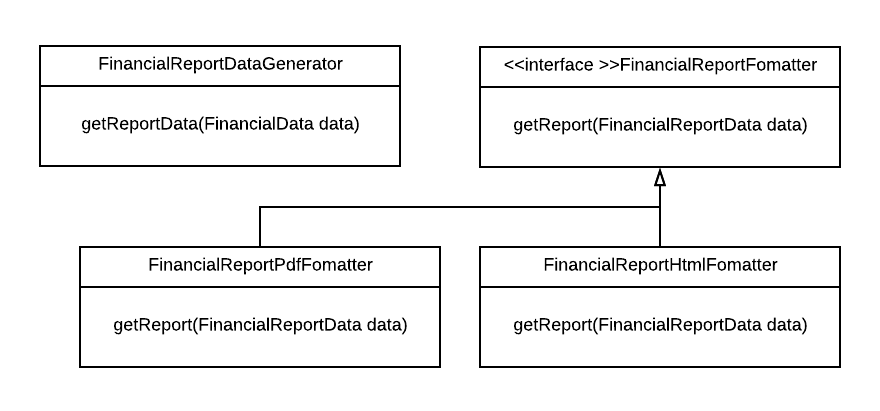

# SOLID principles

## Contents

-   [Single responsibility principle (SRP)](#single-responsibility-principle-srp)
    -   [Example](#example)
-   [Open–closed principle (OCP)](#openclosed-principle-ocp)
    -   [Example](#example-1)
-   [Liskov substitution principle (LSP)](#liskov-substitution-principle-lsp)
    -   [Example violation](#example-violation)
-   [Interface segregation principle (ISP)](#interface-segregation-principle-isp)
    -   [Example](#example-2)
-   [Dependency inversion principle (DIP)](#dependency-inversion-principle-dip)
    -   [Example](#example-3)
    -   [Related: Observer pattern](#related-observer-pattern)
-   [Resources](#resources)

## Single responsibility principle (SRP)

> A class should have only a single responsibility, that is, only changes to one part of the software's specification should be able to affect the specification of the class.

Idea: each class (or module, or function, or ...) should be responsible for a single well-defined part of the functionality of the program, and that part of the functionality should be completely encapsulated within the class (or module, or function, or ...).

Arguably most important principle, is applicable on all levels of the system

Closely related: [Separation of concerns](../Separation-of-concerns.md)

Benefits:

-   Clear separation means you know where to go when one aspect needs to change
-   No chance of unintentionally messing with code related to other aspects
-   Helps us apply some other principles, see below

### Example

Before: financial report generation logic (what to include, calculations) and presentation logic (negative in red, pagination, ...) are mixed.


Problems:

-   Class to change if data to include in report or calculations change, but also if look needs to change
-   Changes to either of these concerns could lead to unexpected bugs in other

Application of SRP: separate report generation and presentation


## Open–closed principle (OCP)

> Software entities (classes, modules, functions, etc.) should be open for extension, but closed for modification.

Origin: C++, needed to explicitly design class to allow others to inherit from it and override its methods

Basic idea: allow changing the code's behavior by adding new code rather than having to change existing code

Still relevant, especially for creating library code!

-   If others are going to use your code as a dependency, they will likely want some extension points where they can add or replace behavior without having to touch your code
-   If the code you are writing will only be used from within your own codebase, changing existing code is much less of a problem and you might want to avoid unneeded complexity and follow the YAGNI (You Aren’t Gonna Need It) principle instead. It might still make sense to foresee extension points in order to lower coupling and increase cohesion, but you could add those on an as-needed bais

What extension could mean here:

-   Inheriting from (abstract) classes or interfaces and overriding methods
-   Delegation: extend from class or its interface, store object of the original class and delegate to it as needed
    -   Useful if class does not allow extension but you can use an interface it implements
    -   Useful if you do not control the creation of instances of the class
-   Composition: allowing behavior to be changed by passing in different objects (dependency injection, Strategy pattern)

### Example

Interface for `FinancialReportFormatter`


Adding PDF format support without changing existing report generation code



## Liskov substitution principle (LSP)

>  Objects in a program should be replaceable with instances of their subtypes without altering the correctness of that program.

In other words: code that expects to get an object of a certain class A shouldn't need to care if it receives an instance of a subclass B of A instead.

### Example violation

```java
public class Rectangle {
    private int width;
    private int height;

    public Rectangle(int width, int height) {
        this.setWidth(width);
        this.setHeight(height);
    }

    public void setWidth(int width) {
        this.width = width;
    }

    public void setHeight(int height) {
        this.height = height;
    }

    public int getArea() {
        return this.width * this.height;
    }
}
```

```java
public class Square extends Rectangle {
    public Square(int size) {
        super(size, size);
    }

    @Override
    public void setWidth(int width) {
        super.setWidth(width);
        super.setHeight(width);
    }

    @Override
    public void setHeight(int height) {
        super.setWidth(height);
        super.setHeight(height);
    }    
}
```

```java
Rectangle rect = codeThatActuallyReturnsASquare();
rect.setWidth(2);
rect.setHeight(5);
assert(rect.getArea() == 10); // fails
```

## Interface segregation principle (ISP)

>  Many client-specific interfaces are better than one general-purpose interface.

Particularly relevant when working with languages that require classes to be recompiled and redeployed if something they depend on changes.

Alternative, more general formulation:

> Avoid depending on things you don't need

Also applies at higher level, e.g. selecting third-party dependencies:

-   Importing huge flexible library could be unnecessarily complex or heavy if all you need is small part
-   Be extra careful if dependencies also have dependencies of their own! Example with Node.js: need to update a module you use because of a vulnerability discovered in some module that it indirectly depends on, three levels down the dependency chain, for some functionality you don't care about

### Example

Before:


After:


## Dependency inversion principle (DIP)

> High-level modules should not depend on low-level modules. Both should depend on abstractions.
>
> Abstractions should not depend on details. Details should depend on abstractions.

More relaxed formulation:

-   Specific parts of your system should depend on general parts, not the other way around.
-   Abstraction can be used as a technique to reverse the direction of dependencies if needed.

### Example

Initial situation


Problem: Dependency points from general part (business logic) to specific part (presentation)

Solution: introduce abstraction to apply DIP


Flow of control still from general part (business logic) to specific part (presentation), but direction of dependency is now reversed

### Related: Observer pattern

[Observer pattern](https://en.wikipedia.org/wiki/Observer_pattern)

Allows a general class to trigger methods on specific classes by letting the specific classes subscribe to the general class. When using this pattern, the general class does not know about the specific classes. All it knows about is an `Observer` interface that the specific classes implement.


## Resources

-   Clean Architure (book by Robert C. Martin)
-   [SOLID](https://en.wikipedia.org/wiki/SOLID)
-   [Functional S.O.L.I.D. Explained In 5 Examples](https://codemanship.wordpress.com/2019/03/15/functional-s-o-l-i-d-explained-in-5-examples/)
-   [OCP vs YAGNI](https://enterprisecraftsmanship.com/posts/ocp-vs-yagni/)
