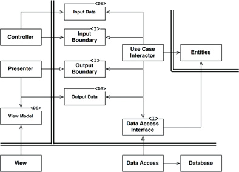

# Clean Architecture

## Contents

-   [Basic idea](#basic-idea)
-   [Benefits/drawbacks](#benefitsdrawbacks)
-   [The different layers](#the-different-layers)
-   [Boundaries between the layers](#boundaries-between-the-layers)
-   [Database independence](#database-independence)
-   [Resources](#resources)

## Basic idea

([image source](https://blog.cleancoder.com/uncle-bob/2012/08/13/the-clean-architecture.html))

-   Inspired by Hexagonal Architecture (Ports and Adapters) etc.
-   Divides the systems into different layers based on technical purpose
-   Inner layers contain business logic, outer layers contain details like the UI, database access, external systems, ...
    -   Outermost layer typically is or contains the "Main" part which glues everything together and starts the system
    -   Business logic layer does not depend on the layer containing database access
-   Direction of code dependencies is always from outer layers to inner layers
    -   The idea is that outer layers act as "plugins" to inner layers
    -   This allows for changes in the outer layers (or the existence of multiple alternatives in the outer layers) without inner layers having to know about it
    -   See bottom-right part of above diagram: flow of control from Use Case Interactor to Presenter but dependency points in other direction
        -   See Dependency Inversion Principle from [SOLID](../oo-design/SOLID-principles.md)
-   Flow of control starts in outer layer, gets down to innermost layers and then goes back to the outer layers
    -   See bottom-right part of above diagram: Controller and Presenter sit in same layer but talk to each other through the use cases layer
    -   Need to take care to enforce this, so for example a Controller will not call a database gateway directly
-   Every layer only communicates with the one directly above/below it
-   Communication between layers typically happens by passing simple DTOs (Data Transfer Objects)

## Benefits/drawbacks

-   Pretty complex
    -   For a simpler alternative that splits layers based on technical purpose, see [Layered architecture](./Layered-architecture.md))
-   Decouples core logic from database, UI, frameworks, ...
    -   Easy to unit test core logic
    -   Database, UI, frameworks ... can be swapped out without requiring changes to the core logic
        -   You might not actually need that flexibility for each of them
    -   Being strict about this can require a lot of overhead in terms of additional classes, getting data in and out of DTOs to pass between layers, taking care of things that your framework would normally automatically take care of, ...
        -   See also below: [Boundaries between the layers](#boundaries-between-the-layers)
    -   Depending on how far you take the "database independence" part, you might be making suboptimal use of your database. See also below: [Database independence](#database-independence)
-   Single functional change likely to require touching several layers
    -   Not meant to be a way to split up system into functional parts that different teams can take full ownership of
    -   Could be very useful inside a single functional part
-   If separation by functional areas is more important, consider looking at [Package by feature or component](./Package-by-feature-or-component.md)

## The different layers

Enterprise Business Rules: Entities

-   Represent core business concepts
-   Encapsulate critical business data and critical business rules
    -   Critical business rules: application-independent business rules that would still be valid for a different application or even if there was no application at all
    -   Example critical business rule: calculating the interest rate for a loan
-   Independent of everything else
-   Do not confuse with "Entity" concept from several ORMs! Entities should be completely independent from database and database frameworks in Clean Architecture

Application Business Rules: Use Cases

-   Represent the use cases of the system
-   Coordinate the entities
-   Encapsulate application-specific business logic (what our system needs to do with the entities)
-   Should only depend on entities
    -   Still independent of UI and database
    -   Should be able to test use cases without any frameworks

Interface Adapters: Controllers, Presenters, Gateways, ...

-   Main idea: converting between format most convenient for use cases and entities and format most convenient for some external part, like the web or the database
    -   Outward: controller for a web API could for example combine data from different entities or include only part of an entity's data to return from the API
    -   Inward: controller takes input and puts into format so uniform that nobody can know if it came from the web, from a CLI, from a SOAP request, ...
-   Controllers and Presenters: triggering use cases and presenting the result
-   Gateways: example is database gateway for interacting with the database
    -   All database-specific logic sits in this layer, there should be no SQL etc. outside of this layer
-   MVC logic of a user interface would fully sit in this layer

Frameworks and Drivers: DB, UI, devices, ...

-   Frameworks and tools such as the database itself, a web framework, ....
-   Typically doesn't contain much more than glue code

Note: in practice, you could have more layers. However, the dependency rule still applies: code dependencies should always point from inner layers to outer layers.

## Boundaries between the layers

([image source](https://softwareengineering.stackexchange.com/questions/380251/clean-architecture-what-is-the-view-model))

-   Main rule: no code in inner layers should depend on code in outer layers!
    -   This also means that the format of the data crossing a layer is defined in the innermost layer
-   Entities know nothing about anything else
-   Use cases know about entities
-   Use cases access database through a Data Access Interface defined **inside** the use cases layer
    -   Interface defines methods like `findEmployeeById` that return entities or DTOs (defined by the use cases or entities layer) that the uses cases layer or entities layer will convert to actual entities
        -   Do not pass "row structure" from a database framework to the inner layers, because this would force an inner circle to know something about an outer circle. Inner circle shouldn't know about the fact that we use a relational database or even the fact that we use an actual separate database at all!
    -   Data Access implementation sits in Interface Adapters layer and depends on the interface specified by the use cases
-   Controllers call use cases through an interface defined in the use cases layer
    -   Likely, the actual Use Case Interactor implementing the logic will not be directly accessible to the controllers
    -   Controller should not care which specific Use Case Interactor is injected into it as long as it satisfies the interface
-   If use case has to call a presenter, this happens through an interface (Output Boundary) defined **inside** the use cases layer that the presenter has to implement
    -   Use Case Interactor should not care which specific Presenter is injected into it as long as it satisfies the interface
-   The View is created from View Model created by the Presenter
    -   View Model contains as much data as possible so minimal logic is required in the view
    -   See also [Humble Object pattern](../Humble-Object-pattern.md)

## Database independence

Robert C. Martin suggests to build all of the business logic before even choosing what kind of database to use, simply writing code against some persistence interfaces describing what kind of data you will need to store and retrieve. This has some particular benefits/drawbacks:

-   You can delay the decision of which kind of database to use until you have a better idea of what you need from your persistence solution
-   By writing code without taking any database's limitations into account, you could make it very hard to find a database that actually has everything you need
-   By defining your entities and their relationships before even choosing what kind of database (relational, document store, ...) you are going to use, you are probably making suboptimal use of the database you end up using
    -   The kind of data you'd want to store together and the way you would want to represent relationships can be totally different for a relational database and a document store
    -   The kind of queries that you can perform in an efficient way can be very different depending on the kind of database that you use
    -   In the end, you might actually find yourself building not-so-pretty workarounds just so you can use your database in a way that fits the persistence interfaces you wrote and the business logic that depends on them
    -   Any mismatch in this area is likely to have a (potentially severe) negative effect on performance
-   Different kinds of databases have different guarantees regarding consistency, transactional behavior, ...
    -   Not properly taking these into account can lead to accidental corruption of data

## Resources

-   Clean Architecture (book by Robert C. Martin)
-   [clean-architecture-example](https://github.com/mattia-battiston/clean-architecture-example)
-   [Uncle Bob's clean architecture - An entity/model class for each layer?](https://softwareengineering.stackexchange.com/questions/303478/uncle-bobs-clean-architecture-an-entity-model-class-for-each-layer)
-   [Implementing Clean Architecture - Of controllers and presenters](http://www.plainionist.net/Implementing-Clean-Architecture-Controller-Presenter/)
-   [Clean Architecture: May the Controller talk to the Presenter directly?](https://softwareengineering.stackexchange.com/questions/388379/clean-architecture-may-the-controller-talk-to-the-presenter-directly)
-   [Implementing Clean Architecture - Make it scream](http://www.plainionist.net/Implementing-Clean-Architecture-Scream/)
