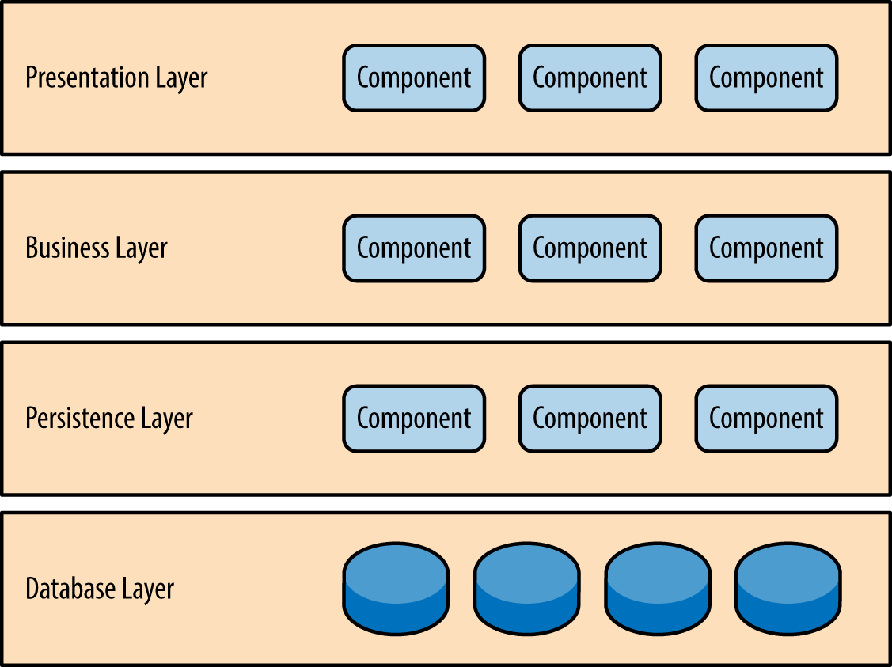
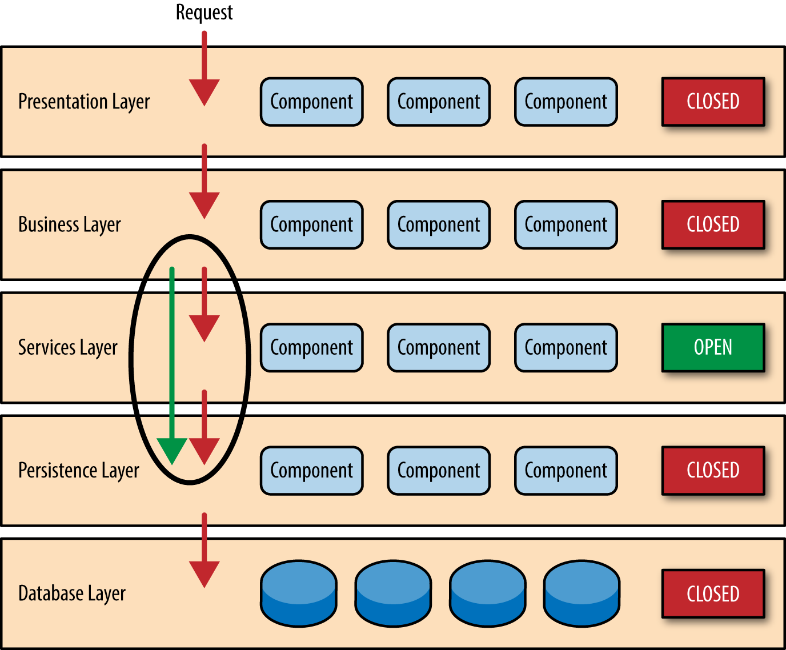

# Layered architecture

See:

- Building Evolutionary Architectures (book by Neal Ford, Rebecca Parsons and Patrick Kua) ([summary slides](https://www.slideshare.net/thekua/building-evolutionary-architectures))
- [Layered Architecture](https://www.oreilly.com/library/view/software-architecture-patterns/9781491971437/ch01.html)
- [Layered Architecture](https://herbertograca.com/2017/08/03/layered-architecture/)

## Basic idea

- System is divided into set of layers based on their technical purpose (separation of concerns)
- Layers encapsulate as much of their behavior as possible in order to isolate layers from changes inside other layers
- Request passes through layers from top to bottom and then back up
  - Each layer can depend one or a few layers below it but should not know anything about any layer above it
- Typical layers (bottom-up):
  - Database layer: the actual database
  - Persistence layer: takes care of talking to the database
    - Provides interfaces for retrieving and saving data (`getUser(id: string)`, `saveUser(user: User)`) 
    - Could return simple data transfer objects or instances of business entity classes that actually encapsulate business logic
      - Try to return something that makes sense from the point of view of the domain, rather than just the structure of database rows (this way, all stuff specific to the kind of database we use is encapsulated in this layer and also easy to change)
  - Business layer: contains business logic to work with entities
    - If persistence layer returns data transfer objects without actual behavior, all business logic will sit here
    - If persistance layer returns instances of classes encapsulating business logic, the business layer will call methods on those instances as needed and coordinate across multiple instances of potentially multiple classes as needed
  - Presentation layer: contains code related to interaction with the user
    - APIs are exposed here
    - Server-side rendering would also sit here
  - Note: a layered architecture could have more layers than these if it makes sense
- Easy to get started with this kind of architecture
- Easy to make technical changes (e.g., swapping out the database) as changes will be confined to a single layer (and if that layer's interface changes, it will likely only affect the layer above it)
- Functional changes are likely to require changes to several layers
  - This often means that a layered architecture is not a good way to split up a system into several parts maintained by independent teams
- Folder structure of projects
  - Option: organize by layer
    - Clearly groups everything within the layer, making it easy to make bigger changes within a single layer
    - As the sytem grows, there will probably need to be several folders within each layer that each represent a certain functional concept
    - Problem: top-level structure (layers) doesn't say anything about the project
    - Problem: when working on a single functional area, you will likely need to find the relevant classes below several top-level folders
  - Option: organize by functional area
    - The folder for a functional area contains all layers, potentially in different subfolders
    - Easy to find everything related to a particular functional area
    - Problem: harder to find everything that belongs in a single layer
- If separation by functional areas is more important, consider looking at [Package by feature or component](./Package-by-feature-or-component.md)

## Open/closed layers

By default, layers are often considered **closed**:

- Requests are not allowed to bypass the layer
- Can be important for security, data integrity, ...
- Helps with maintainability: if a layer can only depend on the layer exactly below it, a change in layer A will only directly impact layer B directly above it
- Example: business logic layer might contain logic deciding whether a certain user can access a certain specific record or not
- Need to take care to enforce this, otherwise it is likely that layers are bypassed in some cases without the team realizing it
  - Hard to enforce using pure encapsulation because every layer needs to expose its functionality for at least one other layer to use (making it likely that logic in other layers can also access it)
  - Could use static analysis tools or linting to detect and forbid bypassing the layer

Sometimes, it makes sense to mark a layer as **open**:

- Requests may or may not bypass the layer
- Layered architecture with open layers is sometimes also called a *relaxed* layered architecture
- Example: services layer with logging, auditing functionality
  - We want this to be called by business layer, not by presentation layer -> put it below business layer
  - However, it does not make sense that business layer would pass through services layer to get entities -> business layer should be allowed to bypass services layer

## Typical antipattern: lasagna architecture

Also called *architecture sinkhole anti-pattern*

Some symptoms:

- Lots of layers
- Large percentage of requests just passed through layers without anything useful happening in most layers
  - In any layered architecture, this will likely be true for a minority of the requests, but it becomes a problem if this is the case for a majority of the requests

Making some layers open could help solve this