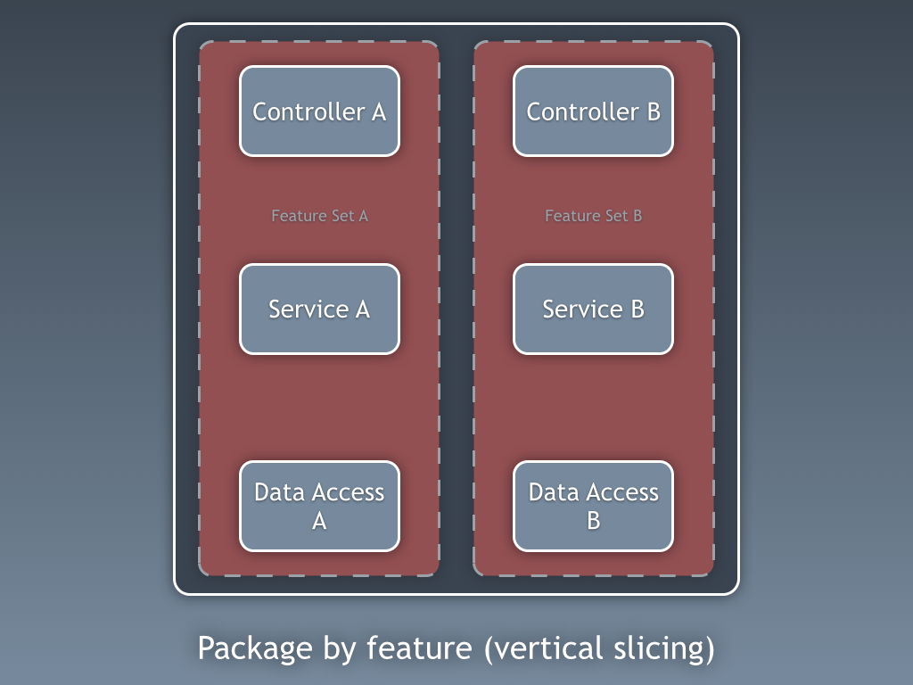
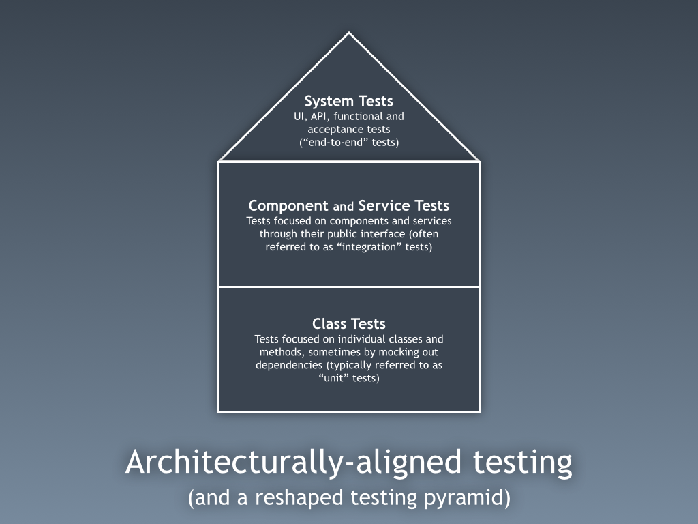

# Package by feature or component

## Contents

-   [Basic idea](#basic-idea)
-   [Benefits/drawbacks](#benefitsdrawbacks)
-   [Testing](#testing)
-   [Resources](#resources)

## Basic idea

([image source](http://www.codingthearchitecture.com/2015/03/08/package_by_component_and_architecturally_aligned_testing.html))

-   Divide system into features/components based on functional areas
-   A feature/component exposes an interface for the outside world to use and hides its internals (including DB access etc.) from the rest of the codebase
    -   In package by feature, features are separated up to the level of controllers
        -   If one feature needs another, it needs to go through the controller
    -   In package by component, the separation happens below the level of controllers
        -   If one component needs to call another, there is no need to go through controllers
        -   Controllers can group and combine data based on what makes sense to API consumers
        -   A single controller can easily use several components (could be especially handy for retrieving data)
        -   A single component could be used by several controllers
        -   The way components are divided into functional areas could potentially differ from the way controllers are divided into functional areas
    -   Encapsulation of internals should be enforced
        -   Ideally, use language constructs like packages, modules, ...
        -   Alternatively, set up custom checks using static analysis. See [Static analysis - Internal dependencies](../../processes-techniques/Static-analysis.md#internal-dependencies).
-   Top-level structure shows functional areas of the application rather than technical layers
-   Within feature/component, likely to have some kind of layered structure, may or may not be the same across all features/components

Note: probably still some cross-cutting concerns that apply to several features/components

-   Can just put these next to the features/components structure
-   Not all code has to be divided into features/components

## Benefits/drawbacks

-   Good way to divide codebase into different functional areas that different teams could potentially take ownership of
    -   "Modular monolith"
    -   Can be a good stepping stone towards microservices
-   Finding a sensible way to divide the system into clearly separated features/components could be challenging or feel artificial for some applications

## Testing

-   Some classes should be tested in isolation
    -   Think domain classes, utility classes, ...
    -   If large amount of mocking needed to test a class in isolation, it's maybe better to test it at another level
-   Some behavior easiest to test through public interface of feature/component
    -   Treat feature/component as black box
    -   Can still be useful to mock other components or external services when doing this

The "reshaped testing pyramid" by Simon Brown (aimed at package by component or microservices):

([image source](http://www.codingthearchitecture.com/2015/03/08/package_by_component_and_architecturally_aligned_testing.html))

## Resources

-   [Package by Feature Is Demanded](https://dzone.com/articles/package-by-feature-is-demanded)
-   [Package by component and architecturally-aligned testing](http://www.codingthearchitecture.com/2015/03/08/package_by_component_and_architecturally_aligned_testing.html)
-   Building Evolutionary Architectures (book by Neal Ford, Rebecca Parsons and Patrick Kua) ([summary slides](http://nealford.com/downloads/Evolutionary_Architecture_Keynote_by_Neal_Ford.pdf))
-   [techtribesje](https://github.com/techtribesje/techtribesje) (example package by component repository)
-   [Deconstructing the Monolith: Designing Software that Maximizes Developer Productivity](https://engineering.shopify.com/blogs/engineering/deconstructing-monolith-designing-software-maximizes-developer-productivity)
-   [Cross-cutting concerns in package-by-feature structure](https://softwareengineering.stackexchange.com/questions/379563/cross-cutting-concerns-in-package-by-feature-structure)
