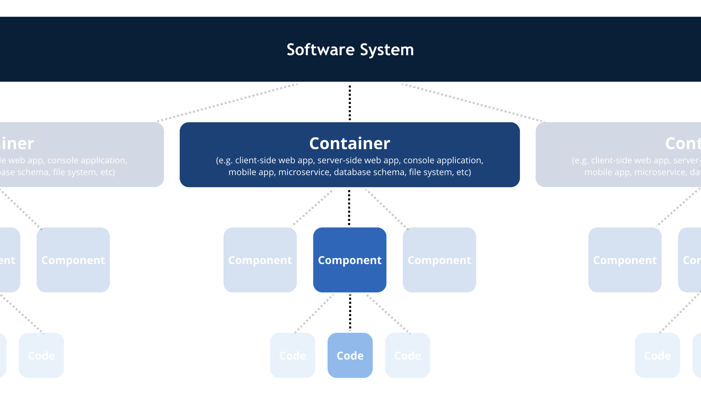
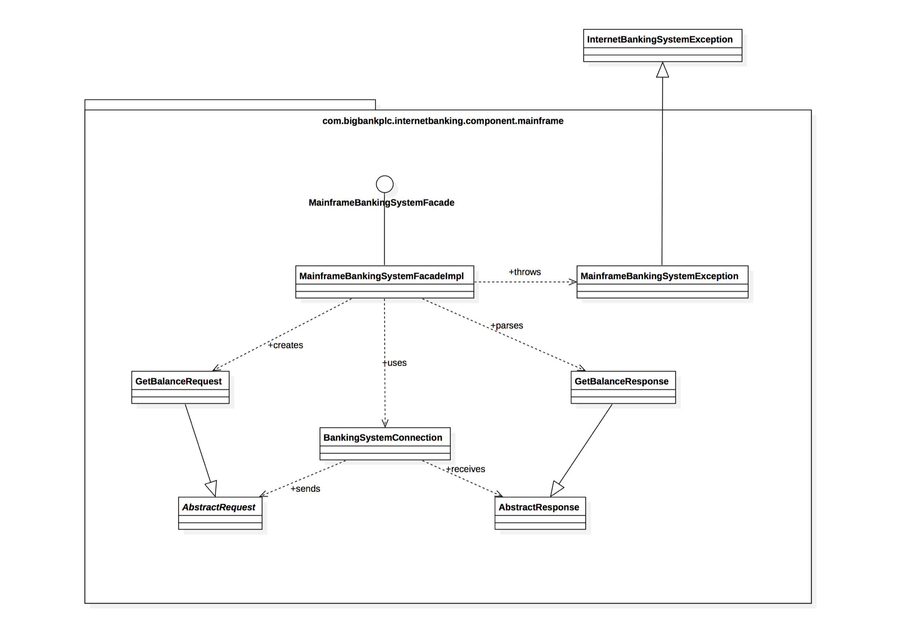

# C4 model

## Contents

-   [Basic idea](#basic-idea)
-   [Main concepts](#main-concepts)
-   [Core diagrams](#core-diagrams)
    -   [Level 1: System Context diagram](#level-1-system-context-diagram)
    -   [Level 2: Container diagram](#level-2-container-diagram)
    -   [Level 3: Component diagram](#level-3-component-diagram)
    -   [Level 4: Code](#level-4-code)
-   [Supplementary diagrams](#supplementary-diagrams)
    -   [System Landscape diagram](#system-landscape-diagram)
    -   [Dynamic diagram](#dynamic-diagram)
    -   [Deployment diagram](#deployment-diagram)
-   [Some details](#some-details)
-   [Resources](#resources)

## Basic idea

-   Created by Simon Brown
-   Goal is to provide a simple and clear way of visualizing a system's architecture
    -   Probably not ideal way to document library, framework or SDK
-   Simplified version of concepts found in [UML](https://en.wikipedia.org/wiki/Unified_Modeling_Language) and the [4+1 model for software architecture](https://en.wikipedia.org/wiki/4%2B1_architectural_view_model)
    -   Aims to make it easy for developers to describe how system works
    -   Aims to minimize the gap between the diagrams and actual code
-   How to create?
    -   Intended to be pretty notation-independent, so can in principle use any diagramming tool
    -   Dedicated diagramming tool: [Structurizr](https://structurizr.com/)
        -   Option: use Java/.NET client libraries
            -   One approach: create model elements imperatively from code
            -   Other approach: extract software architecture information from code (either based on some rules you define or based on annotations)
        -   Option: use browser-based workspace editor
        -   Option: use lightweight Structurizr Express to generate a single diagram with exportable/importable source

## Main concepts

> _A **software system** is made up of one or more **containers** (web applications, mobile apps, desktop applications, databases, file systems, etc), each of which contains one or more **components**, which in turn are implemented by one or more **code elements** (e.g. classes, interfaces, objects, functions, etc)._

-   Person: 
    -   human users of the system
-   Software system: 
    -   highest level of abstraction
    -   describes something that delivers value to its users, whether they are human or not
-   Container
    -   something that hosts code or data
    -   needs to be running in order for the system to work
    -   each container is a separately deployable/runnable thing or runtime environment
    -   communication between containers often rather "expensive" (typically not in same process space)
    -   examples: server-side web application, client-side web application, mobile app, database, microservice, ...
-   Component
    -   grouping of related functionality encapsulated behind a well-defined interface
    -   all components inside a container typically execute in the same process space

## Core diagrams

Different scope and level of detail (compare to zooming in on Google Maps)

### Level 1: System Context diagram

-   big picture
-   shows system surrounded by its users and other systems that it interacts with
-   no technologies, protocols, ...
-   intended audience: both technical and non-technical people, inside and outside the development team
-   likely to change very slowly

### Level 2: Container diagram

-   zoom in on system to show containers
-   shows high-level shape of the software architecture
-   shows major technology choices and how the containers communicate with each other
-   intended audience: technical people, both inside the development team and outside the development team (for example, operations/support)
-   likely to change very slowly

### Level 3: Component diagram

-   zoom in on container to show components
-   intended audience: software architects and developers
-   may change frequently as the team adds, removes or restructures the code into cohesive components
    -   generation through automated tooling can help

### Level 4: Code

-   zoom in on component to show classes, interfaces, ...
-   lowest level of detail, not recommended for anything but the most important or complex components
-   intended audience: software architects and developers
-   will likely become outdated very quickly if the codebase is under active development
    -   if you generate it, generate it automatically, perhaps only on demand

## Supplementary diagrams

Diagrams that can be useful to show other aspects than the core diagrams

### System Landscape diagram

-   basically just a system context diagram without a specific focus on a particular software system
-   helps if you are responsible for a collection of systems
-   intended audience: both technical and non-technical people, inside and outside the development team

### Dynamic diagram

-   describes flow through the system for a specific user story, use case, feature, ...
-   similar to UML [UML communication diagram](https://en.wikipedia.org/wiki/Communication_diagram) and [UML sequence diagram](https://en.wikipedia.org/wiki/Sequence_diagram)
-   intended audience: both technical and non-technical people, inside and outside the development team

### Deployment diagram

-   illustrates how containers in the static model are mapped to infrastructure
-   simplified version of [UML deployment diagram](https://en.wikipedia.org/wiki/Deployment_diagram)
-   intended audience: technical people, both inside the development team and outside the development team (for example, operations/support)

## Some details

-   diagramming large and complex software systems
    -   trying to show all components in the web application on a single diagram may make the diagram too large and the cognitive load too high
    -   consider splitting up a singe complex diagram into several simpler diagrams, each at the same level of abstraction, that each focus on a certain area (technical area, functional area, use case, ...) of the system
-   modeling microservices
    -   if other microservices are outside of your control, model them as "black box" external software systems
    -   if microservices part of a system your are building (you own the services), model them as containers, along with any data stores they use
-   modeling communication in message-driven architecture
    -   option: draw as communication to bus and communication from bus
        -   drawback: hides the coupling between producer and consumer of the message
    -   option: omit message message bus and draw communication as going directly from producer to consumer (but potentially with different color, line style, ... to show that it happens via the bus
-   modeling Java JAR, C# assembly, DLL, ...
    -   typically purely organizational
    -   typically not a container
    -   potentially a component, depending how things are set up
        -   a JAR file might be a component
        -   a JAR fie might contain several components
        -   a single component could also be implemented using code from several JAR files!
    -   likely to be neither a container nor a component!

## Resources

-   [The C4 model for visualising software architecture](https://c4model.com/)
-   [Structurizr](https://structurizr.com/)
