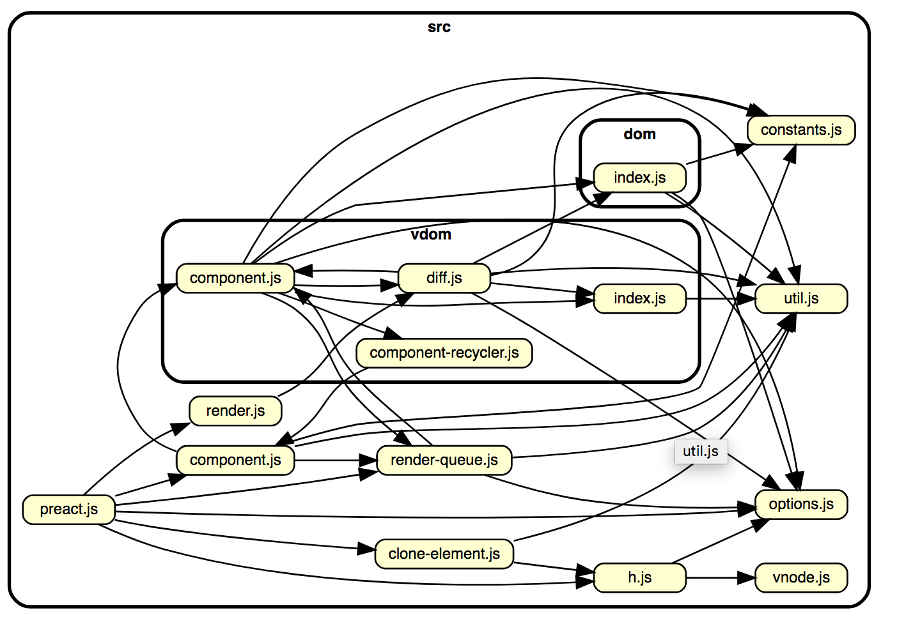

# Visual dependency analysis tools

## Contents

-   [Basic idea](#basic-idea)

## Basic idea

Tools that analyze dependencies in the codebase and use that information to generate graphs, identify clusters of classes that heavily depend on each other, ...

Output could be:

-   static images, generated based on parameters (can be useful for documentation generation)
-   interactively explorable visualizations

Example static images: [How to easily visualize a project's dependency graph with dependency-cruiser](https://www.netlify.com/blog/2018/08/23/how-to-easily-visualize-a-projects-dependency-graph-with-dependency-cruiser/)

Example interactively explorable visualizations: [ngrev](https://github.com/mgechev/ngrev)

Note: you can use these or similar tools to restrict dependencies! See also [Static analysis - Internal dependencies](../../processes-techniques/Static-analysis.md#internal-dependencies).
