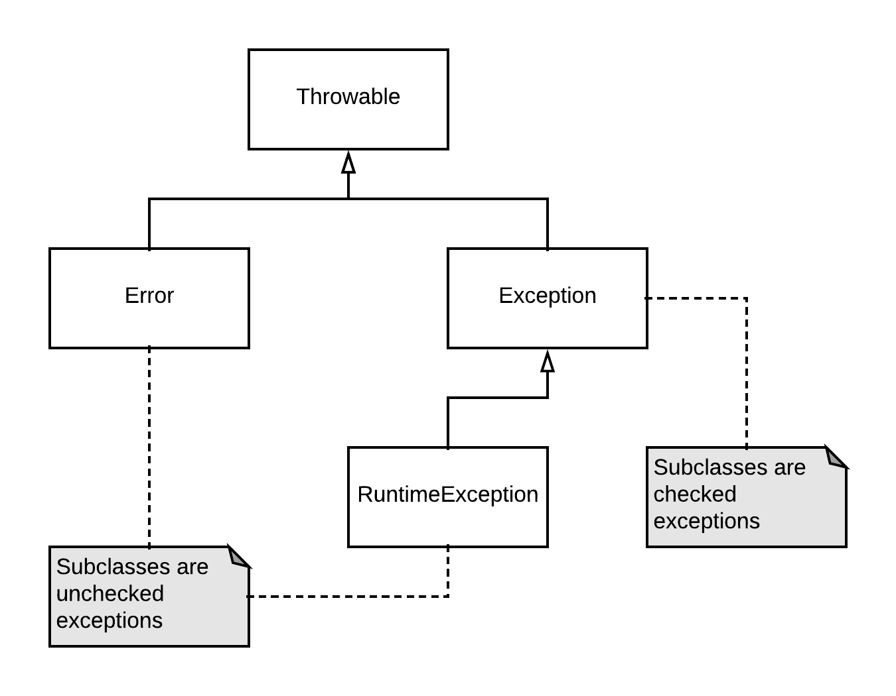

# Exceptions (Java)

## Contents

-   [Basics](#basics)
-   [Checked versus unchecked exceptions](#checked-versus-unchecked-exceptions)
-   [Throwing and the `throws` declaration](#throwing-and-the-throws-declaration)
-   [Catching exceptions](#catching-exceptions)
-   [Cleaning up using try-with-resources](#cleaning-up-using-try-with-resources)
-   [Cleaning up using `finally`](#cleaning-up-using-finally)
-   [Rethrowing and chaining](#rethrowing-and-chaining)
-   [Dealing with `NullPointerException`](#dealing-with-nullpointerexception)
-   [Turning checked exceptions into unchecked exceptions](#turning-checked-exceptions-into-unchecked-exceptions)
-   [Resources](#resources)

## Basics

Exception handling:

-   A method can throw an exception indicating that something is wrong
-   Exceptions automatically bubble up the call chain until they are handled (or, if they are not handled, they end up terminating the current thread)
    -   Great benefit when comparing to error codes which must be manually passed up the chain if needed
-   Typically, exceptions include a stack trace, indicating where the exception occurred in the code and what the call chain looked like at the time

Hierarchy of exception classes in Java:



Classes:

-   `Throwable`: 
    -   Common superclass for all Java exceptions
-   `Error`: 
    -   Exceptions defined by the Java language that are thrown when something really bad happens that the code can normally not recover from by itself
    -   All _unchecked_ (see below)
    -   Example: `OutOfMemoryError`, which occurs when Java is unable to allocate space to an object because there is no more memory available and garbage collection does not help. If you run into that one, the best you can generally do is exit the program.
-   `Exception`:
    -   All user-defined exceptions are subclasses of this one
    -   Exceptions deriving directly from this one are _checked_ (see below) exceptions
-   `RuntimeException` :
    -   User-defined exceptions that are subclasses of this one are _unchecked_ (see below) exceptions 

## Checked versus unchecked exceptions

Basic idea:

-   Checked: Checked by compiler
    -   If your code can possibly throw a checked exception, the Java compiler requires you to either catch the exception or use a `throws` declaration to indicate that your code can throw the exception
-   Unchecked: Not checked by compiler

Intention of this design:

-   Use checked exceptions when there is a reasonable way of recovering from the failure during the execution of the program
    -   Example: a call to open a file and write to it, which can fail if the file does not exist. A reasonable way of recovering from this is trying a different filename.
    -   When using checked exceptions, the compiler forces you to to decide what to do in case such an exception occurs. This prevents you from forgetting that this kind of failure can actually happen.
-   Use unchecked exceptions for errors that the program cannot reasonably recover from
    -   Example: exceptions indicating programming errors, like `NullPointerException`

Alternative school of thought:

-   Use checked exceptions if there is a reasonable way of recovering from the failure during the execution of the program **and** the possibility for failure is unavoidable (an example is a missing file: even if you checked for its existence before, the file can still have disappeared in the meantime)
    -   If the possibility for failure is unavoidable, it makes sense to force the caller to deal with the possible failure
-   Use unchecked exceptions in all other cases.
-   Evaluate these conditions at every level in the call chain.

Yet another different (and popular school of thought):

-   Always use unchecked exceptions. 
-   Never use checked exceptions (unless you are maybe writing a very critical library).
-   This is advertised in, amongst others, the _Clean Code_ book by Robert C. Martin
-   Reason: drawbacks of checked exceptions
    -   If you throw a checked exception from your code and the appropriate handler sits three levels higher in the call chain, you must declare the exception on every method in between
    -   This means that a single change to a small method somewhere deep in the program can require the signature of several higher-level methods to change, breaking encapsulation and coupling the handler of the exception to the code that generates it
    -   This actually negates a large benefit of exceptions, which is that you can decouple the code detecting a failure from the code handling the failure

## Throwing and the `throws` declaration

Throwing unchecked exception:

```java
public static boolean isNumberBetween(int number, int lower, int upper) {
    if (lower > upper) {
        throw new IllegalArgumentException(
            "Lower bound cannot be higher than upper bound");
    }
    
    // ...
}
```

If code can throw a checked exception, a `throws` clause is mandatory!

```java
public void write(String text, String filePath) throws IOException {
    // potentially throws checked IOException
    Files.write(Paths.get(filePath), text.getBytes());
}
```

Throws and inheritance:

-   If you override a method, you cannot throw more checked exceptions than the original `throws` clause specifies. Otherwise, you would break the contract of the method.
-   If a method does not have a `throws` clause, a method overriding it cannot throw any checked exceptions
-   Note that you can perfectly override a method declaring checked exceptions with a method not throwing any exceptions at all

## Catching exceptions

Simple try-catch block:

```java
try {
    // code potentially throwing exception
} catch (TheExceptionClass ex) {
    // code handling the exception
}
```

Can also have multiple catch statements, catching exceptions of different exception classes. They are evaluated top to bottom, so put more specific exception classes first. It is also possible to have a handler that can handle several exception classes.

```java
try {
    // code potentially throwing exception
} catch (ExceptionClass1 ex) {
    // code handling the exception
} catch (ExceptionClass2 | ExceptionClass3 ex) {
    // code handling the exception
}
```

## Cleaning up using try-with-resources

Java offer a _try-with-resources_ statement. In this form of `try`statement, you can specify resources that should be closed automatically. The fact that a resource can be closed automatically is indicated by the fact that it implements the `AutoCloseable` interface.

```java
public void write(ArrayList<String> lines) throws FileNotFoundException {
    try(PrintWriter out = new PrintWriter("output.txt")) {
        for (String line: lines) {
            this.possiblyGenerateException(line);
            out.println(line);
        }
    }
}
```

When the code exits the try block, either because we finished processing the lines or an exception was thrown inside, the `PrintWriter` will be closed automatically. It is also possible to provide multiple resources to a try-with-resources statement. In that case, the order in which they are closed is the reverse of the order in which they were provided.

A try-with-resources statement can also have catch clauses catching any exceptions occurring in the statement.

Note: it is possible that closing an `AutoCloseable` throws an exception itself!

-   If closing happened after normal execution of the `try` block, that exception is passed to the caller
-   If closing happened because of an exception happening inside the `try` block, the exception from the `try` block is passed to the caller and any exceptions generated by subsequently closing the resources will be attached as _suppressed exceptions_ on that exception
    -   When catching the exception that happened in the `try` block (the _primary exception_), you can access those suppressed exceptions by invoking the `getSuppressed()` method on the caught exception.

```java
public class ThrowsOnClose implements AutoCloseable {
    @Override
    public void close() {
        throw new IllegalStateException("Closing");
    }
}
```

```java
try (ThrowsOnClose throwsOnClose = new ThrowsOnClose()) {
    throw new IllegalArgumentException("Inside try");
} catch (Exception e) {
    System.out.println(e.getMessage()); // Inside try

    for (Throwable suppressed: e.getSuppressed()) {
        System.out.println(suppressed.getMessage()); // Closing
    }
}
```

## Cleaning up using `finally`

Alternative to the try-with-resources statement: the `finally` clause. 

-   After the `try` block and potential `catch` blocks, you add a `finally block` which will run after the rest of the try-catch statement has finished
-   Especially useful if you need to clean up something that is not an `AutoCloseable`.
-   Note: avoid throwing exceptions in the `finally` block!
    -   If the code in the `try` block throws an exception and then the `finally` block throws an exception, the caller of the method will only see the exception from the `finally` block. The suppression mechanism we saw above only works with try-with-resources statements.

## Rethrowing and chaining

Rethrowing:

-   Catch the exception
-   Do something useful with it (for example, logging it)
-   Just throw the exception object that you caught

Chaining:

-   Catch the exception
-   Throw a new exception instead
-   Original exception is typically included as the cause for the new exception

Chaining example:

```java
try {
    // set foreign key to parent in database
} catch (SQLException ex) {            
    throw new ParentNotFoundException(ex); // sets ex as cause
}
```

When the caller catches the `ParentNotFoundException`, it can find the original exception using the `getCause()` method. 

In this case, `ParentNotFoundException` has a constructor which allows passing the cause (this is considered good practice). If an exception class does not allow that, the cause for the exception can be set through the `initCause()` method.

## Dealing with `NullPointerException`

`NullPointerException` is an unchecked exception indicating a programming error (we called a method on a null reference). The best way of dealing with `NullPointerException` is to avoid it.

You can make failure with a `NullPointerException` less likely by using the following set of rules for your code:

-   Don’t return null from methods. Wherever possible, return a special case object (e.g. an empty list, which you can easily obtain from `Collections.emptyList()`, or an instance of a dedicated class that was intended for these cases).
-   Don’t pass null as a method parameter. 
-   In some other languages, for example TypeScript, the compiler can actually help you enforce these rules.

The `Objects` class has some convenient methods for preventing problems with null pointers. These can be used for checking arguments or preventing passing null.

-   `Objects.requireNonNull()` throws a `NullPointerException` if the argument is null and returns the argument itself otherwise. This does not prevent the `NullPointerException` from being thrown. However, the benefit here is that we throw it where the source of the problem lies (`null` being passed where it is not allowed) instead of at some later point in the code where we try to invoke a method on a null reference.
-   `Objects.requireNonNullElse()` returns either the first parameter or, if the first parameter is null, it returns the second parameter. It is quite similar to the `COALESCE`function in SQL.

```java
public static void test(String name, String nickname) {
    name = Objects.requireNonNull(name);
    nickname = Objects.requireNonNullElse(nickname, "nick");
}
```

Something else that can help is the `Optional` type.

## Turning checked exceptions into unchecked exceptions

In some cases, you may find yourself getting a checked exception which you want to pass up the method chain as an unchecked exception (for example because you are overriding a method without a `throws` declaration allowing the checked exception).

Simplest way to do this: chaining (see above)

-   Catch checked exception
-   Throw new unchecked exception with checked exception as the cause

More sneaky approach: trick the Java compiler into ignoring checked exceptions. Example implementation (taken from _Core Java SE 9 for the Impatient_):

```java
public class Exceptions {
    @SuppressWarnings("unchecked")
    private static <T extends Throwable> 
            void throwAs(Throwable e) throws T {
        throw (T) e; // erased to (Throwable) e
    }

    public static <V> V doWork(Callable<V> c) {
        try {
            return c.call();
        } catch (Throwable ex) {
            Exceptions.<RuntimeException>throwAs(ex);
            return null;
        }
    }
}
```

Now, any checked exceptions thrown inside the `doWork` method are ignored by the compiler.

```java
public static void test() {
    // error: unhandled FileNotFoundException
    new PrintWriter("output.txt"); 

    // ok
    Exceptions.doWork(() -> new PrintWriter("output.txt"));
}
```

Although this is a pretty cool trick, it is not generally applicable in practice. Not only would it be confusing to catch an `IOException` from a method that doesn’t declare it, but the compiler does not even allow you to do it.

```java
public static void invokeTest() {
    try {
        test();
    } catch (IOException ex) {
        // error: unreachable catch block
    }
}

public static void test() {        
    Exceptions.doWork(() -> new PrintWriter("output.txt"));
}
```

Some cases where this trick may make sense (although not necessarily good practice):

-   Dealing with “impossible” exceptions
    -   Some methods in the standard library have a `throws`clause declaring checked exceptions, although there are some sets of arguments which are _guaranteed_ to _never_ throw an exception
    -   If you know that you are passing such a set of arguments, you could use this trick to stop the compiler from bothering you about this impossible exception.
-   Creating a `Runnable` that can throw a checked exception in its `run()` method (which does not declare any checked exceptions)
    -   You can define custom error handling behavior for the thread (for both checked and unchecked exceptions) in the thread’s uncaught exception handler

Example of the `Runnable` case:

```java
public class TestRunnable implements Runnable {
    @Override
    public void run() {
        Exceptions.doWork(() -> new PrintWriter("unwritableFile"));
    }
}
```

```java
Thread thread = new Thread(new TestRunnable());
        
thread.setUncaughtExceptionHandler(new UncaughtExceptionHandler() {
    @Override
    public void uncaughtException(Thread t, Throwable e) {
        if (e instanceof IOException) {
            System.out.println("Caught IOException");
        }
    }
});

thread.start(); // Caught IOException
```

## Resources

-   Core Java SE 9 for the Impatient (book by Cay S. Horstmann)
-   Clean Code (book by Robert C. Martin)
-   [Unchecked Exceptions — The Controversy](https://docs.oracle.com/javase/tutorial/essential/exceptions/runtime.html)
-   [When to choose checked and unchecked exceptions](https://stackoverflow.com/questions/27578/when-to-choose-checked-and-unchecked-exceptions)
-   [Project Lombok @SneakyThrows (throwing checked exceptions as unchecked)](https://projectlombok.org/features/SneakyThrows)
