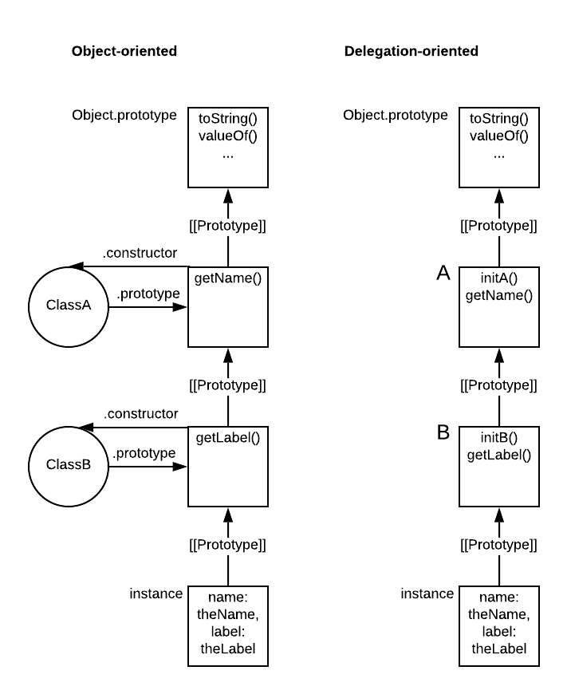

# Object prototypes and classes (JavaScript)

## Contents

-   [JavaScript objects](#javascript-objects)
    -   [Built-in objects](#built-in-objects)
-   [The prototype chain](#the-prototype-chain)
    -   [Property shadowing](#property-shadowing)
    -   [Prototype pollution](#prototype-pollution)
-   [Functions and `.prototype`](#functions-and-prototype)
-   [Prototypical inheritance and object-oriented design](#prototypical-inheritance-and-object-oriented-design)
-   [Object-oriented design vs. delegation-oriented design](#object-oriented-design-vs-delegation-oriented-design)
-   [Classes](#classes)
    -   [Instance-level fields](#instance-level-fields)
    -   [Static (class-level) fields](#static-class-level-fields)
        -   [Simulating static class fields](#simulating-static-class-fields)
-   [Encapsulation](#encapsulation)
    -   [Encapsulation using private fields and methods](#encapsulation-using-private-fields-and-methods)
    -   [Encapsulation without using private fields and methods](#encapsulation-without-using-private-fields-and-methods)
-   [Resources](#resources)

## JavaScript objects

Misconception: "everything is an object in JavaScript"

-   There _simple primitives_ (`string`,  `number`, `boolean`, `null`, and `undefined`) which are not objects
-   However, everything else is indeed an object: simple objects, arrays, functions, ...

Example:

```javascript
console.log(typeof "test"); // string
console.log(typeof 1); // number
console.log(typeof true); // boolean
console.log(typeof null); // object (although null is really its own primitive type)
console.log(typeof undefined); // undefined
console.log(typeof {}); // object
console.log(typeof []); // object
console.log(typeof new Date()); // object
console.log(typeof /aaa/g); // object

// "trick" to show an object's type in more detailed fashion
console.log(Object.prototype.toString.apply({})); // [object Object]
console.log(Object.prototype.toString.apply([])); // [object Array]
console.log(Object.prototype.toString.apply(new Date())); // [object Date]
console.log(Object.prototype.toString.apply(/aaa/g)); // [object RegExp]
```

### Built-in objects

-   `String`,  `Number`, `Boolean`, `Object`, `Function`, `Array`, `Date`, `RegExp`, `Error`
-   Look like actual types, even classes
-   In reality, they are actually just built-in functions

Example with `String` (note how it behaves differently when it's called as constructor):

```javascript
const test = "test";
console.log(typeof test); // string
console.log(test instanceof String); // false

const test2 = String("test");
console.log(typeof test2); // string
console.log(test2 instanceof String); // false

// not preferred, doesn't create normal string values
const test3 = new String("test");
console.log(typeof test3); // object
console.log(test3 instanceof String); // true
```

Although it is preferred to represent strings as normal `string` values, all of the interesting methods are defined on `String`. JavaScript solves this by coercing to `String` as needed.

```javascript
console.log("test".indexOf("s")); // 2
```

When not called as constructor, `String` (and also `Number` and `Boolean`) is useful for performing type conversions:

```javascript
const test = String(3);
console.log(test); // 3
console.log(typeof test); // string

const test2 = Number("4");
console.log(test2); // 4
console.log(typeof test2); // number

const test3 = Boolean("something");
console.log(test3); // true
console.log(typeof test3); // boolean
```

## The prototype chain

Every JavaScript object has an internal `[[Prototype]]` property that is a reference to another object. If we try to get a property from an object that is not present on the object itself, JavaScript follows the `[[Prototype]]` link of the object. If it's not found on that object, it follows that object's `[[Prototype]]` link, until the end of the chain is reached. The chain formed by the `[[Prototype]]` links is called the _prototype chain_.

The prototype chain typically ends at the built-in `Object.prototype`

Note: in a lot of JavaScript engines, objects have a `__proto__` property that exposes the object's internal `[[Prototype]]` property, but its use is deprecated. It's better to use `Object.getPrototypeOf` instead.

Example:

```javascript
const objectA = {
    a: "testA"
};

// create objectB with [[Prototype]] pointing to objectA
const objectB = Object.create(objectA);
console.log(Object.getPrototypeOf(objectB) === objectA); // true
console.log(Object.getPrototypeOf(objectA) === Object.prototype); // true

// a not found on objectB -> follow prototype chain to objectA
console.log(objectB.a); // testA
//toString not found on objectB -> follow prototype chain to Object.prototype
console.log(objectB.toString()); // [object Object]
```

In the above example, we can say that `objectB` prototypically inherits from `objectA`

Note: an object can only prototypically inherit from a single other object. There is no multiple inheritance here.

### Property shadowing

_Shadowing_ occurs when a property on an object hides a property with the same name deeper down the prototype chain. This can often be a source of confusion. Therefore, it's recommended to avoid creating properties with a name that already exists somewhere in the chain.

It's easy to accidentally shadow a property! Example:

```javascript
const objectA = {
    counter: 1
};

const objectB = Object.create(objectA);

console.log(objectA.counter); // 1
console.log(objectB.counter); // 1

console.log(objectA.hasOwnProperty("counter")); // true
console.log(objectB.hasOwnProperty("counter")); // false

objectB.counter++; // implicit shadowing!

console.log(objectA.counter); // 1
console.log(objectB.counter); // 2
console.log(objectB.hasOwnProperty("counter")); // true
```

Here, the line `objectB.counter++` is equivalent to `objectB.counter = objectB.counter + 1`, which:

-   Looks for a property `counter` on the prototype chain and finds it on `objectA`
-   Gets the value of that property
-   Creates a new property `counter` on `objectB`

From that point on, `objectB` has its own `counter` property shadowing the `counter` property on `objectA`.

Shadowing is not only an issue with simple properties but also with methods (which are just properties with a function as value). Therefore, it is recommended to avoid creating different methods with the same name in a prototype chain.

Property shadowing can also be caused by unexpected input from the outside and it can hide methods that are defined on the `Object` prototype itself. Example:

```javascript
const userInput = JSON.parse(`{ "hasOwnProperty": 1 }`);

// TypeError: userInput.hasOwnProperty is not a function
console.log(userInput.hasOwnProperty("propA")); 

// explicitly call the function defined on Object.prototype
console.log(Object.prototype.hasOwnProperty.call(userInput, "propA")); // false
```

You can mitigate the risk that this happens by checking user input and rejecting input that contains unexpected properties. It also helps to avoid calling methods provided through `Object.prototype` on the object itself (first approach in the above code) but instead explicitly use the function from `Object.prototype` (second approach in the code). There is actually a rule in ESLint ([no-prototype-builtins](https://eslint.org/docs/rules/no-prototype-builtins)) that enforces this.

### Prototype pollution

Prototype pollution is a vulnerability in code that allows input coming from the outside to mess up your prototype chain.

Example:

```javascript
const userInput = JSON.parse(`{
    "newProp": "test",
    "__proto__": {
        "polluted": "true",
        "toString": "whoops"
    }
}`);

// vulnerable recursive merge
function merge(target, source) {
    for(var attr in source) {
        if(typeof(target[attr]) === "object" && typeof(source[attr]) === "object") {
            merge(target[attr], source[attr]);
        } else {
            target[attr] = source[attr];
        }
    }
    return target;
};

const oldObject = {};

const merged = merge({ a: "test"}, userInput);

console.log(merged.newProp); // test
const newObject = {};
console.log(oldObject.polluted); // true
console.log(newObject.polluted); // true
// Object.prototype is polluted, affecting all Objects!

console.log(newObject.toString()); // TypeError!
```

Prototype pollution vulnerabilities could be exploited to prevent system from working normally (DOS attack), set certain properties that bypass normal access checks or even inject some code into an application (see [Prototype pollution attacks in NodeJS applications](https://www.youtube.com/watch?v=LUsiFV3dsK8&feature=emb_logo)). 

Some ways to avoid being vulnerable:

-   If you need to write your own recursive merge, make sure to have it ignore `__proto__`
    -   Vulnerabilities in libraries like Lodash have already been patched
-   Validate all user input, rejecting any input with unexpected properties
-   An interesting way to avoid this kind of attack is to freeze the Object prototype. If you add `Object.freeze(Object.prototype);` on top of the example above, the vulnerability is gone. This works because the freeze prevents the prototype from being altered in any way.

## Functions and `.prototype`

Every JavaScript function has `prototype` property. You could call this the function's prototype, although some would say that's confusing.

In any case, every object that is constructed through the function using `new` syntax will have a `[[Prototype]]` linking to the function's `prototype` property.

```javascript
// PascalCase is just a convention
function Test(value) {
    this.value = value;
}

const a = new Test("A");
console.log(Object.getPrototypeOf(a) === Test.prototype); // true

Test.prototype.log = function () {
    console.log(this.value);
}

a.log(); // A

Test.prototype.log = function () {
    console.log("Second implementation: " + this.value);
}

a.log(); // Second implementation: A
```

As the above code shows, we can add behavior to the function's `prototype` property by defining properties on it with a function as value. We can call these functions through the new object (looking up `log` works the same as looking up any other property on the prototype chain).

You can also see that lookups in the prototype chain happen in a dynamic way (`[[Prototype]]` links point to objects, no "copying of behavior" is done, there is just a chain which is traversed whenever properties are looked up). We can add a method to `Test`'s prototype, even after we have used it to create `a`, and `a` can use that method. We can later even overwrite the implementation with a new one. This offers a lot of possibilities, but could also be confusing.

## Prototypical inheritance and object-oriented design

The example regarding functions and `prototype` already showed something that looked like classes. We can use the same mechanisms to simulate something like class inheritance:

```javascript
function ClassA(name) {
    this.name = name;
}

ClassA.prototype.getName = function () {
    return this.name;
};

function ClassB(name,label) {
    // call ClassA as a function, using the current this
    // this simulates 'calling the superclass constructor'
    ClassA.call(this, name);
    
    this.label = label;
}

// option 1: replace ClassB.prototype with new object that inherits from ClassA.prototype
// note: ClassB.prototype.constructor is now gone (doesn't point to ClassB anymore)
ClassB.prototype = Object.create(ClassA.prototype);
// option 2 (from ES6): modify existing ClassB.prototype to inherit from ClassA.prototype
// this keeps the data, like .constructor, already present in ClassB.prototype
Object.setPrototypeOf(ClassB.prototype, ClassA.prototype);

ClassB.prototype.getLabel = function () {
    return this.label;
};

const instance = new ClassB("theName", "theLabel");
console.log(instance.getName()); // theName
console.log(instance.getLabel()); // theLabel
```

If you just look at the lines at the bottom, the syntax seems very similar to for example Java. However, it is still just prototypical inheritance at work, with property lookups following the prototype chain at runtime.

## Object-oriented design vs. delegation-oriented design

The above example tried to apply object-oriented design to JavaScript. There is also an alternative way, preferred by some, which doesn't try to simulate classes but instead fully embraces the concept of prototypes.

Example which does the same as the object-oriented example above:

```javascript
const A = {
    initA: function (name) { // normal function syntax
        this.name = name;
    },
    getName() { // cleaner syntax, available from ES6
        return this.name;
    }
}

const B = {
    initB(name, label) {
        this.initA(name); // delegated to A via prototype chain
        this.label = label;
    },
    getLabel() {
        return this.label;
    }
}

Object.setPrototypeOf(B, A);

const instance = Object.create(B);
instance.initB("theName", "theLabel");
console.log(instance.getName()); // theName
console.log(instance.getLabel()); // theLabel
```

As you can see in the above example, delegation-oriented design is a bit more explicit about the fact that JavaScript uses prototypical inheritance rather than class-based inheritance like some other languages.

Note that the "constructor" functionality, which sat in the functions `ClassA` and `ClassB` in the previous example, is now implemented as separate `initA` and `initB` functions on the objects, as there is no other place to put it.

Comparison of how the two approaches compare in terms of objects created and their relationships (adapted from [You Don't Know JS](https://github.com/getify/You-Dont-Know-JS)):



## Classes

Basic idea:

-   New syntax introduced in ES6
-   In the background we still just have prototypes and the prototype chain!

Example of how to implement the example from above using ES6 classes:

```javascript
class A {
    // designated place to put constructor functionality
    constructor(name) {
        this.name = name;
    }

    getName() {
        return this.name;
    }
}

// no need to manually link prototypes
class B extends A { 
    constructor(name, label) {
        super(name); // easy way to call superclass constructor
        this.label = label;
    }

    getLabel() {
        return this.label;
    }
}

const instance = new B("theName", "theLabel");
console.log(instance.getName()); // theName
console.log(instance.getLabel()); // theLabel
```

Leads to pretty clean syntax, although it is still important to remember that JS didn't suddenly get a new class inheritance mechanism!

Example indicating that we're still using runtime delegation based on prototypes:

```javascript
class Test {
    getString() {
        return "test";
    }
}

const oldInstance = new Test();
console.log(oldInstance.getString()); // test

Test.prototype.getString = function () {
    return "newImplementation";
}

const newInstance = new Test(); 
console.log(newInstance.getString()); // newImplementation

console.log(oldInstance.getString()); // newImplementation
```

Example indicating that accidental shadowing is still possible:

```javascript
class Test {
    constructor() {
        this.id = "whoops";
    }

    id() {
        return "test";
    }
}

const instance = new Test(); // id() on Test.prototype is shadowed by id on instance
console.log(instance.id()); // TypeError: instance.id is not a function
```

### Instance-level fields

Modern JavaScript supports the concept of "field declarations", a more explicit way of declaring the class' fields. This feature was added long after classes were introduced  ([check browser support on Can I Use](https://caniuse.com/?search=public%20class%20fields)).

The code below is an example of using public instance fields:

```javascript
class A {
    name = 'you can specify a default if you want';
    
    constructor(name) {
        this.name = name;
    }

    getName() {
        return this.name;
    }
}
```

For some info on private instance fields, see below: [Encapsulation using private fields and methods](#encapsulation-using-private-fields-and-methods)

### Static (class-level) fields

You can use static fields if you want a field to exist at the level of the class rather than at the level of its instances. This feature was added long after classes were introduced ([check browser support on Can I Use](https://caniuse.com/?search=public%20class%20fields)).

```javascript
class Test {
    static SHARED_COUNTER = 0;

    incrementSharedCounter() {
        Test.SHARED_COUNTER++;
    }
  
    getSharedCounter() {
        return Test.SHARED_COUNTER;
    }
}

const instance = new Test();
console.log(instance.getSharedCounter(), Test.SHARED_COUNTER); // 0, 0

Test.SHARED_COUNTER++;
console.log(instance.getSharedCounter(), Test.SHARED_COUNTER); // 1, 1

instance.incrementSharedCounter(); //
console.log(instance.getSharedCounter(), Test.SHARED_COUNTER); // 2, 2
```

For some info on private static fields, see below: [Encapsulation using private fields and methods](#encapsulation-using-private-fields-and-methods)

#### Simulating static class fields

If you need to keep a shared property at the level of the class but you can't use static fields, the best approach is probably to set it directly on the class (rather than, for example, on the `.prototype` of the class where the methods sit). Note: setting the property directly on the class is also how TypeScript implements static class properties.

Working example putting properties directly on the class:

```javascript
class Test {
    incrementSharedCounter() {
        // use Test.sharedCounter and not this.sharedCounter
        Test.SHARED_COUNTER++; 
    }
  
    getSharedCounter() {
        return Test.SHARED_COUNTER;
    }
}

Test.SHARED_COUNTER = 0;

const instance = new Test();
console.log(instance.getSharedCounter(), Test.SHARED_COUNTER); // 0, 0

Test.SHARED_COUNTER++;
console.log(instance.getSharedCounter(), Test.SHARED_COUNTER); // 1, 1

instance.incrementSharedCounter();
console.log(instance.getSharedCounter(), Test.SHARED_COUNTER); // 2, 2
```

Accidental shadowing when putting on the `.prototype`:

```javascript
class Test {
    incrementSharedCounter() {
        this.SHARED_COUNTER++; // accidental shadowing!
    }
  
    getSharedCounter() {
        return this.SHARED_COUNTER;
    }
}

Test.prototype.SHARED_COUNTER = 0;

const instance = new Test();
console.log(instance.getSharedCounter(), Test.prototype.SHARED_COUNTER); // 0, 0

Test.prototype.SHARED_COUNTER++;
console.log(instance.getSharedCounter(), Test.prototype.SHARED_COUNTER); // 1, 1

instance.incrementSharedCounter(); // instance now gets its own SHARED_COUNTER property
console.log(instance.getSharedCounter(), Test.prototype.SHARED_COUNTER); // 2, 1
```

## Encapsulation

One important concept in object-oriented design is _encapsulation_: classes expose a public interface while hiding internals using private fields and private methods.

Example of a class without any encapsulation:

```javascript
class A {
    constructor(name) {
        this.name = name;
    }

    getName() {
        return this.name;
    }
}

const instance = new A("theName");
instance.name = "test";
console.log(instance.getName()); // test
```

### Encapsulation using private fields and methods

This feature was added long after classes were introduced ([check browser support on Can I Use](https://caniuse.com/?search=private%20class%20fields))

Example using private fields:

```javascript
class A {
    #name;

    constructor(name) {
        this.#name = name;
    }

    getName() {
        return this.#name;
    }
}

const instance = new A("theName");
instance.#name = "test"; // SyntaxError
```

Note that private fields cannot be added dynamically, they can only be declared up-front

Private fields can also be **static** (class-level). In this case, it's recommended to always access them through the class itself rather than using `this` in the code for a static method, since the latter can lead to some confusing errors.

```javascript
class BaseClassWithPrivateStaticField {
    static #PRIVATE_STATIC_FIELD;

    static basePublicStaticMethod() {
        // do this
        return BaseClassWithPrivateStaticField.#PRIVATE_STATIC_FIELD;
    }
}

class SubClass extends BaseClassWithPrivateStaticField {}

BaseClassWithPrivateStaticField.basePublicStaticMethod(); // ok
SubClass.basePublicStaticMethod(); // ok
```

```javascript
class BaseClassWithPrivateStaticField {
    static #PRIVATE_STATIC_FIELD;

    static basePublicStaticMethod() {
        // don't do this
        return this.#PRIVATE_STATIC_FIELD;
    }
}

class SubClass extends BaseClassWithPrivateStaticField {}

BaseClassWithPrivateStaticField.basePublicStaticMethod(); // ok
SubClass.basePublicStaticMethod(); // TypeError
```

In addition to private fields, you can also add private (static) **methods**

```javascript
class A {
    #name;

    constructor(name) {
        this.#setName(name);
    }

    getName() {
        return this.#name;
    }

    #setName(name) {
        this.#name = `some prefix + ${name}`;
    }
}

const instance = new A("theName");
instance.#setName("test"); // SyntaxError
```

### Encapsulation without using private fields and methods

For a long time, JavaScript classes did not support the concept of private fields (or even fields in general). In order to still support encapsulation, people came up with all kinds of workarounds (closures, `Symbols`, `WeakMaps`, `Proxies`, ...), but all of those workarounds have some performance or "cleanness" disadvantages. See: [Private properties in JavaScript](https://curiosity-driven.org/private-properties-in-javascript), [Private properties in JavaScript ES6 classes](https://stackoverflow.com/questions/22156326/private-properties-in-javascript-es6-classes), [ES6 classes with private members](https://dev.to/jankapunkt/es6-classes-with-private-members-144d), ...

Example simulating private fields using closures (drawback: methods are created again for every instance instead of just putting them on the prototype):

```javascript
class A {
    constructor(name) {
        this.getName = function() {
            return name;
        }
        
        this.setName = function(newName) {
               name = newName;
        }
    }
}

const instance = new A("theName");
console.log(instance.getName()); // theName
instance.setName("theNewName");
console.log(instance.getName()); // theNewName

console.log(instance.name); // undefined
instance.name = "test";
console.log(instance.getName()); // theNewName
```

Simplest workaround: convention that properties starting with underscore (`_`) are private. Example:

```javascript
class A {
    constructor(name) {
        this._name = name;
    }

    getName() {
        return this._name;
    }
}

const instance = new A("theName");
instance._name = "test"; // as per convention, you should not do this
```

## Resources

-   [You Don't Know JS](https://github.com/getify/You-Dont-Know-JS)
-   [The Complete JavaScript Course](https://www.udemy.com/course/the-complete-javascript-course/)
-   [String](https://developer.mozilla.org/en-US/docs/Web/JavaScript/Reference/Global_Objects/String)
-   [Inheritance and the prototype chain](https://developer.mozilla.org/en-US/docs/Web/JavaScript/Inheritance_and_the_prototype_chain)
-   [Prototype pollution attacks in NodeJS applications](https://www.youtube.com/watch?v=LUsiFV3dsK8&feature=emb_logo)
-   [Public class fields](https://developer.mozilla.org/en-US/docs/Web/JavaScript/Reference/Classes/Public_class_fields)
-   [Private class features](https://developer.mozilla.org/en-US/docs/Web/JavaScript/Reference/Classes/Private_class_fields)
-   [Private properties in JavaScript](https://curiosity-driven.org/private-properties-in-javascript)
-   [Private properties in JavaScript ES6 classes](https://stackoverflow.com/questions/22156326/private-properties-in-javascript-es6-classes)
-   [ES6 classes with private members](https://dev.to/jankapunkt/es6-classes-with-private-members-144d)
