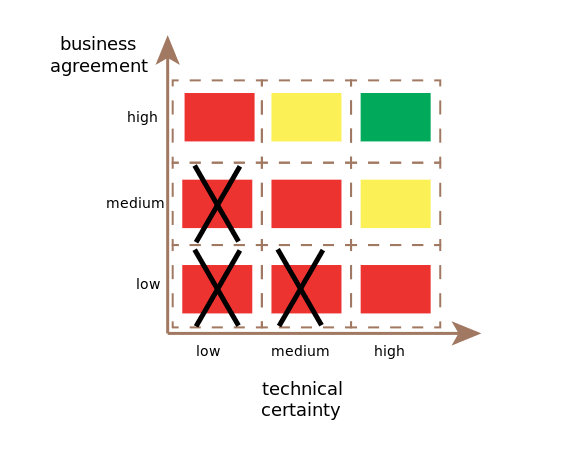

# Dealing with uncertainty

## Contents

-   [Basic idea](#basic-idea)
-   [Analyzing uncertainty](#analyzing-uncertainty)
-   [Dealing with uncertain tasks](#dealing-with-uncertain-tasks)
    -   [Removing technical uncertainty](#removing-technical-uncertainty)
    -   [Removing functional uncertainty](#removing-functional-uncertainty)
-   [Resources](#resources)

## Basic idea

-   Uncertainty about what to build and how to build it can hugely reduce your productivity and happiness as a developer
    -   Unclear goals
    -   Unclear acceptance criteria
    -   Unclear how to achieve things from the technological side
-   There are likely not only _known unknowns_ but also _unknown unknowns_ that only surface when you dive deep into the functionality or solution approach
    -   It can be useful to make a conscious effort to tease these out early through mockups, prototypes, ... (see also [Fail fast](../mindset/Fail-fast.md))

## Analyzing uncertainty

Framework used at ThoughtWorks:

([image source](https://dev.to/kmruiz/understanding-uncertainty-in-software-development-an-agile-way-22m6))

Axes:

-   Technical certainty: how well does the development team understand how to build the feature?
-   Business agreement: how well does business agree on what goes into the feature and how the system should behave?

Different areas of the diagram:

-   **Red with cross**: the task can't be done at the moment and you might also want to split/redefine it later on
-   **Red**: the task needs clarification before it can be started
-   **Yellow**: the task is not entirely clear, but it should be possible to start tackling it
-   **Green**: it's clear what to do, the implementation should be relatively straightforward and predictable

Benefits of the framework:

-   Makes uncertainty explicit
-   Can help to start conversations needed to get rid of the uncertainty
    -   During conversations, focus on writing down what the questions and unknowns are that need to be resolved

## Dealing with uncertain tasks

-   In the short-term, focus on getting rid of the uncertainty
    -   In SCRUM, you can define a Spike for this ([Spikes in Scrum](https://medium.com/@leanscrummaster/spikes-in-scrum-3c80a65dce58))
    -   It might make sense to postpone the implementation to the next sprint
-   Assign someone to take the lead in clearing out the uncertainty
-   Make sure to keep a clear list of what questions need to be answered
-   It might make sense to prioritize clarification of unclear tasks rather than working on more clear tasks first
    -   Tease out unknown unknowns as soon as possible
    -   Ensure that the team is not suddenly blocked by a backlog with only unclear tasks
    -   See also [Fail fast](../mindset/Fail-fast.md)

### Removing technical uncertainty

Useful technique: time-boxing

-   Pick a predefined amount of time (2 hours, 1 day, ...) to spend on researching and experimenting
    -   Can be done by one person or a small sub-team
    -   Research by itself is often not enough. You might need to build some kind of prototype to really get a feel for what works and what doesn't. See also [Fail fast](../mindset/Fail-fast.md).
-   When the time is up, get back to the team with the results
-   Decide together with the team if further time-boxed sessions are needed/appropriate

Why it helps to time-box:

-   Helps to prevent going down rabbit holes or getting stuck in analysis paralysis
-   Forces regularly checking in with the team
    -   Can lead to useful ideas from the team for further time-boxed sessions
    -   Allows correcting course if needed based on feedback from the team
        -   The team can function as compass to help you focus on the essence
        -   See also [Fail fast](../mindset/Fail-fast.md)
    -   Allows re-evaluating whether the effort is actually worth it

### Removing functional uncertainty

It often helps to do some kind of prototyping: mockups, wireframes, page flows, ... (see also [Fail fast](../mindset/Fail-fast.md))

## Resources

-   [Understanding uncertainty in software development: an Agile way](https://dev.to/kmruiz/understanding-uncertainty-in-software-development-an-agile-way-22m6)
-   [Lean Inception - Technical and Business Review](https://martinfowler.com/articles/lean-inception/tech-and-business-review.html)
-   [Dealing With Unknowns In Software Development](https://blog.professorbeekums.com/managing-unknowns/)
-   [Spikes in Scrum](https://medium.com/@leanscrummaster/spikes-in-scrum-3c80a65dce58)
