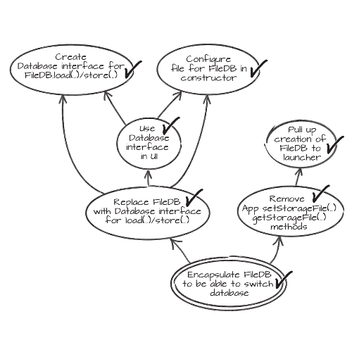

# Refactoring

## Contents

-   [Basic idea](#basic-idea)
-   [Why refactor?](#why-refactor)
-   [When to refactor?](#when-to-refactor)
-   [What to refactor?](#what-to-refactor)
-   [How to refactor](#how-to-refactor)
    -   [Mikado method](#mikado-method)
-   [Refactor versus rewrite](#refactor-versus-rewrite)
-   [Resources](#resources)

## Basic idea

Refactoring:

-   Technique for restructuring existing code without changing its behavior
-   Series of small, behavior-preserving transformations
    -   Each transformation (a "refactoring") does little
    -   Subsequently applying a lot of these transformations can significantly change structure
    -   Each of these transformations should leave system in a working state

Refactoring is not the only way to restructure code (rewriting is another), but it has some specific benefits

## Why refactor?

Benefits of restructuring in general:

-   Makes sure continuous change doesn't lead to continuously increasing complexity and messiness
-   Saves time and energy by making it easier to add new code and read/change existing code
    -   Code quality is essential for maintaining development speed in the long term

Benefits specific to refactoring:

-   Benefits of sequential small transformations where each one keeps system in working state:
    -   Low risk
    -   Short feedback loop
    -   You can stop/pause after any one of these small transformations if time is tight
-   Even tiny refactorings (like changing a variable's name) might suddenly allow you to see bigger issues
    -   Reasoning about design is a lot harder if basic things like names are not clear
    -   Making the code easier to read can suddenly make bugs more obvious

## When to refactor?

-   Refactoring should be part of the normal development process, so apply it as needed when it makes sense
    -   You'll likely find yourself going back and forth between "functional changes mode" and "refactoring mode"
    -   It can be useful to make separate commits for functional changes and refactorings (see [Small commits and pull requests - Small, atomic commits](./Small-commits-pull-requests.md))
-   When adding/changing functionality, it can make sense to refactor existing code first so the change is easier
-   After getting new functionality working, it can make sense to refactor for future maintainability
-   When running into unclear or hard-to-use code, it can make sense to refactor it
    -   Refactoring can actually help you understand code: as you figure out small parts (what a section of code does, what a variable _actually_ represents), you can make small refactorings to make that knowledge obvious
-   If you are very close to a deadline, it can make sense to postpone refactoring until after the deadline

## What to refactor?

Finding code that could benefit from refactoring:

-   Any code that is unclear, too complex or otherwise hard to maintain could use some refactoring
-   Looking for [Code Smells](https://sourcemaking.com/refactoring/smells) can help

Make sure it's actually worth it!

-   Refactoring means investing time and energy now to save time and energy in the (near) future
-   Make sure that the payoff from refactoring will actually be worth the effort
-   Refactoring an awkward design that costs the team valuable time every week is much more useful than refactoring something inside a well-tested part of the system that almost never has to change
-   See also [Keep it simple - Effort](../mindset/Keep-it-simple.md#effort)

What not to refactor:

-   Code that is such a mess that it's best to just start over and rewrite from scratch
    -   See below, [Refactor versus rewrite](#refactor-versus-rewrite)
-   If you are deliberately keeping some duplication for the sake of flexibility, refactoring only one of the duplicates makes it a lot harder to spot the duplication and to merge the duplicates later on if desired
    -   If possible, refactor either all of the duplicates or none of them
    -   See also [Duplication](../architecture-design/Duplication.md)

## How to refactor

-   Before getting started, make sure the code you're about to refactor has good automated tests
    -   Check that tests still pass after every refactoring
    -   Confidence that all your small refactorings indeed keep the system in a working state
    -   Short feedback loop if you happen to mess up
-   Tools can help (IDEs often offer refactoring functionality) but are not required
-   Some useful refactorings that might apply to your specific case:
    -   [Catalog of Refactorings](https://refactoring.com/catalog/)
    -   [Refactoring techniques](https://sourcemaking.com/refactoring/refactorings)
-   Combining multiple small refactorings into big change
    -   Sequentially apply refactorings one at a time (at most one in progress at any given time)
    -   Making huge changes with the system broken until you're fully done is not refactoring!
    -   Mikado method can help (see below)

### Mikado method

Problem:

-   You want to perform a relatively big restructuring
-   For every refactoring you try to do, you run into other ones that would need to happen first
    -   I want to do A, but then I need to do B and C first, but for B I need to do X and Y first, ..
-   Just going with the flow and diving deeper into things as you discover them is not a good option
    -   It's hard to keep track of all the loose ends (or even your end goal) as you pile on in-progress changes
    -   The system will be broken until you finish it all
    -   It's hard to know how close you are to being finished and having a working system
    -   This is not real refactoring anymore, which means you lose some the benefits of real refactoring (low risk, short feedback loop, can stop/pause after every small step)

Solution: Mikado method

Mikado method summary (from [Legacy Code: The Mikado Method](https://www.davidtanzer.net/david%27s%20blog/legacy_code/2018/05/21/legacy-code-mikado-method.html)):

1.  Write down your current goal
2.  Try to reach that goal directly
3.  If you fail
    1.  Write down everything that prevents you from reaching your current goal as a sub-goal
    2.  Revert your changes
    3.  For each sub-goal, repeat 1
4.  If you succeed
    1.  Commit your changes
    2.  Repeat with the next goal

Writing down your main goal and sub-goals results in a nice graph, example:

([image source](http://mikadomethod.info/))

Benefits:

-   Allows you to get the benefits of real refactoring
-   Provides a nice visualization of process and progress
    -   Useful to keep yourself on track
    -   Useful for communicating progress to stakeholders
    -   Can be used as a collaboration tool to allow people to work towards the main goal in parallel

Hardest part: actually throwing away your changes if you can't reach your current goal directly

-   Resist the temptation to stash them, copy them to another directory, ...
-   Remember: changes represent most direct path you saw towards goal, but that path apparently didn't work
-   Remember: changes did serve a purpose, as they let you identify sub-goals that need to be completed first

## Refactor versus rewrite

Rewriting:

-   Alternative way of restructuring
-   Just throw away some chunk of existing code and replace it with new code
-   Chunk of existing code could be a method, a file, a subsystem, ...

When it can make sense to rewrite instead of refactor:

-   We actually want to change behavior
    -   Example: Existing code is full of bugs
    -   Example: Workflow provided by current code doesn't match current business reality anymore
-   It's impossible or impractical to reach our end goal through incremental refactoring
    -   Example: Moving to different technology (note: make sure it's worth the effort!)
    -   Example: Existing code is such a mess that it's way more efficient to just rewrite it

Drawbacks of rewriting:

-   High risk of introducing bugs
    -   Forgetting to implement non-obvious behavior existing code, bugs specific to new code, ...
-   Need to complete rewrite to get system in (hopefully) working state again
    -   Longer feedback loop (cannot properly test for regression before rewrite is complete)
    -   Cannot stop/pause before rewrite is complete
-   The bigger the scope of the rewrite, the bigger these drawbacks become
    -   Additional drawback: rebuilding functionality you already had soon gets boring and demotivating
    -   Some other specific drawbacks of large-scale rewrites (entire systems or apps): [The Risks of Rewrites](http://www.bennorthrop.com/rewrite-or-refactor-book/chapter-2-the-risks-of-rewrites.php)

Be careful, rewrites are tempting even when they are not really the best option!

-   Problems with current code, especially code quality problems, are often pretty obvious
-   Potential problems with new planned approach are often less obvious
    -   There might be some edge cases that it doesn't account for
    -   There might be some issues with the design that only become clear once you're developing it
-   Developing something new is more exciting than maintaining something existing
    -   Humans seem to be hard-wired to enjoy creating things and to attach more value to their own creations
    -   Building something new allows you to craft a solution in the way that makes most sense to you
-   Rewriting feels like a chance to "finally do it right"
-   We have a tendency to take mental shortcuts and replace hard questions with easier ones
    -   The question "Is the ROI of rewriting higher than the ROI of refactoring?" gets replaced (consciously or subconsciously) by questions like "is the existing code messy" or "are we using old technology"

So, should you rewrite instead of refactoring?

-   Default answer should probably be "no" and changing it to "yes" should require a lot of justification
-   Would the ROI from rewriting really be higher than the ROI of refactoring?
-   Make sure to keep in mind the risks of rewriting and the fact that it's so tempting

## Resources

-   Refactoring: Improving the Design of Existing Code (book by Martin Fowler)
-   Martin Fowler's [Refactoring.com](https://refactoring.com/)
    -   [Catalog of Refactorings](https://refactoring.com/catalog/)
-   SourceMaking: [Refactoring](https://sourcemaking.com/refactoring)
    -   [Code Smells](https://sourcemaking.com/refactoring/smells)
    -   [Refactoring techniques](https://sourcemaking.com/refactoring/refactorings)
-   [RefactoringMalapropism](https://martinfowler.com/bliki/RefactoringMalapropism.html)
-   [What is the Mikado Method?](http://www.methodsandtools.com/archive/mikado.php)
-   [The Mikado Method: A Great Help to Work With Legacy Code](https://improveandrepeat.com/2020/12/the-mikado-method-a-great-help-to-work-with-legacy-code/)
-   [Legacy Code: The Mikado Method](https://www.davidtanzer.net/david%27s%20blog/legacy_code/2018/05/21/legacy-code-mikado-method.html)
-   [Zen Of Refactoring](https://www.schibsted.pl/blog/zen-of-refactoring/)
-   [The Risks of Rewrites](http://www.bennorthrop.com/rewrite-or-refactor-book/chapter-2-the-risks-of-rewrites.php)
-   [Why we Rewrite (Even When we Shouldn't)](http://www.bennorthrop.com/rewrite-or-refactor-book/chapter-3-why-we-rewrite-even-when-we-shouldnt.php)
-   [Refactor vs. Rewrite](https://remesh.blog/refactor-vs-rewrite-7b260e80277a)
