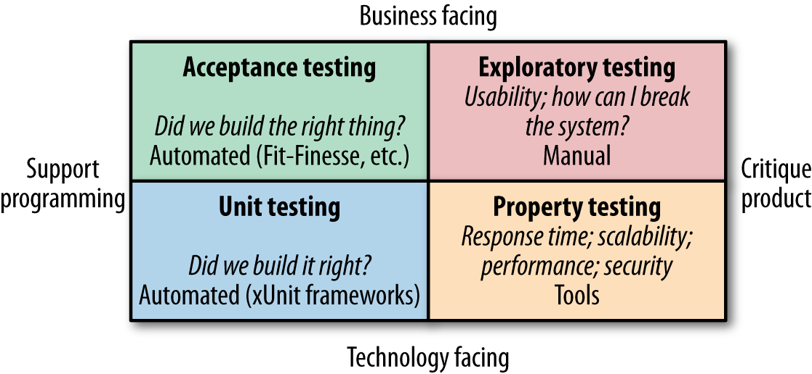
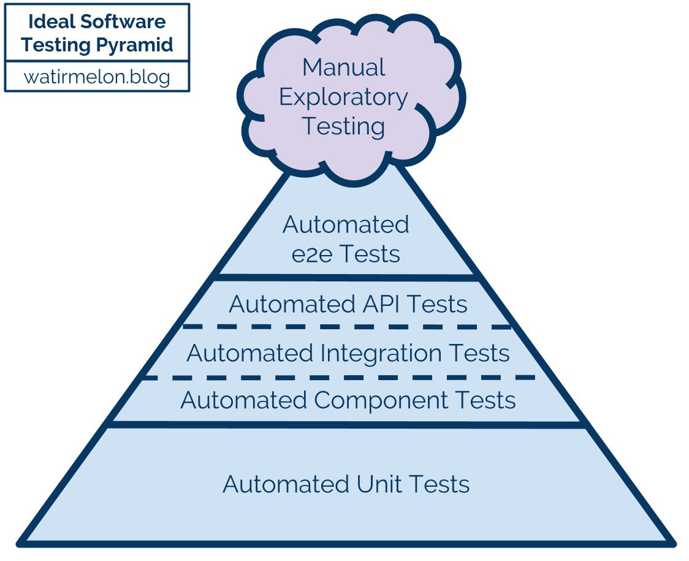

# Testing

## Contents

-   [Why testing?](#why-testing)
-   [Testing terminology](#testing-terminology)
-   [Types of testing](#types-of-testing)
-   [Test automation](#test-automation)
-   [Test pyramid](#test-pyramid)
-   [What to write tests for](#what-to-write-tests-for)
-   [Writing tests](#writing-tests)
-   [Writing testable code](#writing-testable-code)
-   [Test Doubles](#test-doubles)
-   [Unit tests](#unit-tests)
    -   [Testing behavior versus testing implementation](#testing-behavior-versus-testing-implementation)
    -   [Test-driven development](#test-driven-development)
-   [Component tests](#component-tests)
-   [Integration tests](#integration-tests)
-   [End-to-end tests](#end-to-end-tests)
-   [Contract tests](#contract-tests)
    -   [CDC tests versus end-to-end tests](#cdc-tests-versus-end-to-end-tests)
-   [UI tests](#ui-tests)
-   [Acceptance tests](#acceptance-tests)
-   [Performance tests](#performance-tests)
-   [Testing patterns](#testing-patterns)
-   [Test coverage](#test-coverage)
-   [Testing after production](#testing-after-production)
-   [Complementary techniques](#complementary-techniques)
-   [Resources](#resources)

## Why testing?

-   Check that software behaves as intended by development team
-   Check that software does what user needs it to do
-   Prevent regressions (existing functionality being broken by changes)
    -   Good tests give you the confidence to change code, refactor, ...
-   Provide documentation about how the system as a whole or its internals are working

## Testing terminology

-   People commonly have different understandings of testing terminology
    -   Service vs. component vs. integration, UI vs. end-to-end, ...
    -   There is no objective right or wrong, software development community just hasn't managed to settle on some common well-defined terminology
-   Regardless of exact terminology, general concepts and ideas stay the same
-   Just use terminology that works for you and your team
    -   Ideally, you can stick to consistent terminology within your team and maybe even your company

Note: Since this note aggregates material from different sources, it likely won't use fully consistent terminology

## Types of testing

([image source](https://www.oreilly.com/content/building-microservices-testing/))

Four important types of testing:

-   **Unit testing**
    -   Automated tests
    -   Check that the system has been built correctly and behaves as intended
-   **Acceptance testing**
    -   Ideally automated tests
    -   Check that the team built the right thing and that the system does what the user needs it to do
-   **Exploratory testing**
    -   Manually play with the system
    -   Check for usability issues
    -   Check for ways in which unexpected user behavior can break the system
-   **Property testing**
    -   Testing of non-functional requirements like scalability, performance, security, ...
    -   Can use specialized tools (performance testing tools, tools that check for common security vulnerabilities, ...)

## Test automation

General idea: automate where possible!

-   Avoids human errors
-   Typically orders of magnitude faster than manual testing
-   Well-written testing code is great documentation about the way the system works
    -   Shows examples of how functionality should behave
    -   Shows examples of how to interact with certain parts of the system
    -   Unlike other forms of documentation, tests cannot silently get out of sync with reality!

Manual testing and exploration still useful!

-   Automated testing is great at testing known scenarios, but manual exploratory testing is needed to discover scenarios that haven't been thought of before
    -   Take some time to try and break the application, find design issues, notice slow response times, ...
    -   Often makes sense to set up fixed schedule with timeboxed sessions (example: 1 hour per month)
    -   Things you find can later be added to the suite of automated tests
-   Things like _usability_ cannot be checked by a machine

## Test pyramid

([image source](https://alisterbscott.com/kb/testing-pyramids/))

Basic idea:

-   Pyramid of automated tests, cloud above representing limited manual testing
-   Lower levels of the pyramid (foundation):
    -   Faster (short feedback loop)
    -   More focused and isolated, less brittle
    -   Confidence that parts work in isolation, but not that they work together correctly
-   Higher levels of the pyramid:
    -   Slower (long feedback loop)
    -   More integrated, more confidence that the entire thing works
    -   More obviously linked to how an actual user uses the system
    -   Allow bigger refactoring to happen without having to change the tests
    -   Less clear what the problem is if a test fails
    -   Needs more work to set up components that need to be running, ensure proper data is available, clean up leftover data afterwards, prevent tests from stepping on each other's toes, ...
    -   Higher chance of tests failing randomly
    -   Higher chance of tests breaking because of some small insignificant change like changing a button's text
-   Pyramid shape indicates that more tests should live at the lower levels

General advice:

-   Test at the lowest level that makes sense
    -   Example: When testing complex backend rules for input validation, it probably doesn't make sense to test all of them through the UI. Instead, test them at a lower level, and potentially test one case end-to-end to make sure the UI properly handles validation errors in general.
    -   Example: When you have a legacy "big ball of mud" system that you need to get under control, your only sensible option might be to test against the system boundary
    -   Also applies to non-functional testing! Some things might be possible to test at a lower level
-   If something fails at a higher level, see if you can test for that specific thing at a lower level instead
    -   Failure of a higher-level test often indicates a missing or incorrect lower-level test
    -   Write the missing lower-level test _before_ fixing the bug, so you're sure the test catches it
-   Don't completely abandon higher-level testing, you need confidence that the system as a whole is working

Running tests:

-   Faster tests (lower levels of the pyramid) can be run constantly (while developing, when committing, ...)
    -   This kind of fast feedback is very important! See also [Fail fast](../mindset/Fail-fast.md)
-   Slower tests (higher levels of the pyramid) can be impractical to run constantly
    -   Entire suite could be run in a pipeline for every commit, or even just periodically for very heavy tests
    -   It could make sense to run a few specific ones during development if they're relevant to the current work

## What to write tests for

In principle, could write dedicated tests for every piece of code in system. In reality, that's not possible or practical.

Some general advice:

-   Focus on the non-trivial code
    -   Trivial plumbing code is naturally tested by higher-level tests that check everything is wired together correctly
-   Focus on areas where you need more confidence
    -   If you're afraid of changing a certain part of the code, that part needs more tests
    -   If you're afraid of what deploying new code will do to a certain part of the system, that part needs more tests
    -   If you're afraid that parts will work individually but won't fit together properly, you need more high-level tests
-   Pareto principle: 80% of the confidence might come from 20% of the potential testing effort
    -   See also [Keep it simple - Effort](../mindset/Keep-it-simple.md#effort)
-   In some cases, [Testing after production](./testing-details/Testing-after-production.md) might make more sense

Backend versus frontend:

-   Often, automated testing effort (especially unit testing) is focused on the backend
    -   Backend logic is often more complex than frontend logic
    -   Anyhow, people will play with the frontend during manual exploratory testing and usability testing
    -   Frontend bugs might have limited impact as long as the backend ensures data validity and consistency
-   Still, don't neglect the frontend too much
    -   If frontend has complex logic, not all cases will (or should) be covered by end-to-end tests and manual tests
    -   Proper exploratory or usability testing only happens every once in a while
    -   Frontend bugs can be frustrating to users

Long story short, focus your testing effort where it creates the most value (high ROI)

## Writing tests

Common structure for a test: **arrange, act, assert**

-   First part sets up a situation
-   Second part invokes the behavior we're trying to test
-   Third part checks that the result was what we expected

Keep test code clean

-   Test code is as important as production code
-   Tests need to change as functionality/requirements change, messy tests make this hard
-   The more readable tests are, the higher their documentation value

Tests should be independent

-   One test should not set up data for the next one
-   If tests depend on each other, you cannot run tests individually
-   If tests depend on each other, one failing test can make a bunch of others fail, making diagnosis more difficult

## Writing testable code

Testable code = code that makes it easy to write actual high-value tests at lower levels

Some basic tips for testable design:

-   Apply the usual good practices: [Separation of concerns](../architecture-design/Separation-of-concerns.md), [Single responsibility principle (SRP)](../architecture-design/oo-design/SOLID-principles.md#single-responsibility-principle-srp), ...
-   [Inversion of control](../architecture-design/Inversion-of-control.md) can help (dependency injection is an example of this)
-   Prefer [Composition over inheritance](../architecture-design/oo-design/Composition-over-inheritance.md)
-   Pull complex logic into things that are easy to test
    -   See [Testing patterns - Humble Object pattern](./testing-details/Testing-patterns.md#humble-object-pattern)
    -   Ideally, most complex logic sits in pure functions: input -> output, no other state involved
        -   Prefer passing input directly to the code instead of making code retrieve it from somewhere
-   In some cases, it can make sense to wrap libraries or other dependencies so you have more control over them
    -   Example: [Testing patterns - Clock Wrapper pattern](./testing-details/Testing-patterns.md#clock-wrapper-pattern)

## Test Doubles

Test Double: something you use in tests instead of a real object, database, service, ...

Different kinds of Test Doubles:

-   **Dummy objects**: Objects that are passed as required parameter but never actually used
-   **Fakes**: Actual working implementations, but not suitable for production
    -   Example: in-memory test database instead of the real thing
-   **Stubs**: Provide canned answers to specific predefined calls
-   **Spies**: Stubs that record some information on how they were called
-   **Mocks**: Pre-programmed with expectations regarding calls they're expected to receive
    -   Can throw exception if they receive an unexpected call
    -   Test code can ask them if they received all the calls they expected

Test Double use cases:

-   Use test doubles in unit tests to keep them fast and isolated
-   Use test doubles in integration tests or end-to-end tests if testing against the real thing is not practical
    -   Example: in-memory database in integration tests
    -   Example: fake third-party service
        -   Relevant tool (Java): WireMock
        -   Relevant tool (JavaScript): PollyJS
        -   Relevant tool (cross-platform): Mountebank
        -   Could also just be a custom-developed piece of backend with some canned responses

Test Doubles could also be useful outside of automated testing!

-   Example: a fake third-party service can be useful during development and manual testing of functionality that needs the service as a dependency, or even for customer demos

## Unit tests

Basic idea:

-   Most focused tests, make sure that a certain unit works as expected
-   Unit: function, method, class, group of tightly-related classes, ...
-   Avoid interaction with slow/brittle external dependencies like DB, network, file system, ...

Sociable versus solitary:

-   **Solitary unit tests**: use test doubles for all outside collaborators (other functions, methods, classes, ...)
    -   Can be useful if working with real collaborators is awkward
-   **Sociable unit tests**: allow talking to real collaborators (other functions, methods, classes, ...)
    -   Provide more confidence that things are really working    
    -   Allow refactoring communication with collaborators without having to change the tests
    -   You can cover a lot of ground with these!    
    -   Still avoid interaction with DB, network, file system, ...
    -   Some would not call these "unit tests" anymore

What to unit test:

-   You can use unit tests for code at any layer
-   Focus on where the most complex logic sits
    -   Ideally, code structure makes it easy to unit test that logic (see also [Writing testable code](#writing-testable-code))
-   Test public interface (functionality that class exposes to the outside world)
    -   If you feel the need to test a private method separately, this is a sign that the class you're testing is too complex and has too many responsibilities. Extract the logic of the private method to a separate, easily-testable class.
-   Ensure that all non-trivial code paths are tested
-   Don't unit test trivial code!
    -   You gain nothing from unit testing simple getters/setters or other trivial code (example: no conditional logic)

Test your unit as a whole:

-   Focus on testing the scenarios that the unit must support, not its specific parts
-   If you find yourself testing one specific part of your unit at a time, you probably actually have multiple units
-   When your unit is a class, you likely don't want to go one method at a time
    -   Example: When testing a list, most test cases will use a combination of constructor, `add`, `get`, `size`, ...

When to write unit tests:

-   Often good to write them before or together with the production code they test
    -   Writing production code before writing tests can result in code that's hard to test
-   Before writing them, you need to know what your units look like and how they should behave/interact
    -   Sometimes, it makes sense to start building something and discover/change the building blocks as you go, only writing tests once you are happy with your units, their behavior and how they are connected. After that, the tests could be your guide while refactoring your units' internals.
    -   If you have a properly unit-tested but bad design, the tests might keep you from changing it
-   See also below: [Test-driven development](#test-driven-development)

### Testing behavior versus testing implementation

Make sure to test _behavior_ rather than _implementation_

-   Test that are tightly tied to implementation need to change on every refactor
    -   This means you lose the benefit of unit tests as a safety net for refactoring
    -   If every refactor requires unit tests to change, it's a sign that you're testing implementation
    -   Extreme case: tests that basically describe the full implementation's code
-   Go for "If I provide X and Y, I get Z" instead of "The method will call A, then B, then sum the responses"
-   Ask yourself: what does client code care about?
    -   Code using your class typically doesn't care about how it orchestrates its dependencies, so don't test for that
    -   Exceptionally, a class' main purpose is the orchestration of dependencies, so you should test exactly that

### Test-driven development

Basic process:

1.  Write a new unit test and verify that it fails for the expected reason
2.  Write exactly the production code that's needed to make the test pass
3.  Refactor as needed, with tests as safety net
4.  Repeat

More detailed example of the process: [Introduction to Test Driven Development (TDD)](https://medium.com/hackernoon/introduction-to-test-driven-development-tdd-61a13bc92d92)

Benefits:

-   Starting by writing a failing test means that you're sure the test is actually testing something
-   Writing tests before production code ensures that production code is testable
-   Making things work one test at a time provides a clear focus, tests can guide implementation

Drawbacks/challenges:

-   TDD requires you to know beforehand what your units look like and how they should behave/interact
-   Being too strict about "writing only production code strictly needed to make tests pass" can be wasteful
    -   Does it make sense to write overly simplistic code if you know you'll need a proper algorithm in the end?

Similar alternative: test-first development (first specify all tests you can think of, then write production code)

## Component tests

Basic idea:

-   Test a specific component of the system (a whole bunch of units working together)
-   Could use test doubles for external dependencies (some would just call them unit tests in that case, see above)
    -   Allows testing things at a relatively high level while still being fast
-   Could use actual external dependencies (some would just call them integration tests in that case, see below)
    -   Could also use something close to the real thing, like in-memory datastore instead of real DB

See also [Package by feature or component](../architecture-design/reference-architectures/Package-by-feature-or-component.md)

More detailed application of this in microservices context: [Testing Strategies in a Microservice Architecture - Component testing](https://martinfowler.com/articles/microservice-testing/#testing-component-introduction)

## Integration tests

Basic idea:

-   Test how application integrates with external dependencies (DB, filesystem, network, ...)
    -   This is the stuff you leave out of unit tests
-   It can help to test one integration point at a time while replacing others with test doubles where needed

What to integration test: basically every place where you _serialize_ or _deserialize_ data

-   Calls to your own application's REST API
-   Reading from and writing to databases
-   Calling other application's REST APIs
-   Reading from and writing to queues
-   Reading from and writing to file system

Testing against external dependencies:

-   Ideally, run local instance of external dependency (local DB, local file system, ...)
    -   Could instead run something close to the real thing, but then not fully confident that integration also works in production
        -   Example: using in-memory H2 as database instead of normal PostgreSQL
        -   Example: calling fake REST API instead of the real one
    -   It could help to spin up instances using Docker or similar, triggered from your testing code
-   Plan B: run dedicated test instance somewhere and test against that one
    -   Network calls will make tests slower
    -   Make sure that (failed) tests don't mess up data for other tests

## End-to-end tests

Basic idea: test entire running system, with all its dependencies

-   Biggest confidence that the entire system works
-   Slow, longer feedback loop
-   Flaky, false positives: tests can fail because of browser quirks, timing issues, ...
-   Require a lot of setup (database, other external dependencies, data initialization, ...)
-   Require a lot of maintenance

What to test against:

-   Typically run against the actual running UI using something like Selenium or Cypress
-   Can also run **subcutaneous tests** that operate just below the actual UI (for example, calling API instead)
    -   Often helps to make tests less flaky
    -   Risk of missing certain logic that's defined above what you're testing ([Humble Object pattern](../architecture-design/Humble-Object-pattern.md) can help)
    -   Useful tool for firing real HTTP requests at your API: REST-assured

Testing environment

-   Avoid flakiness caused by [snowflake servers](https://martinfowler.com/bliki/SnowflakeServer.html)
-   Instead, try to use infrastructure-as-code to build a fresh environment on the fly in a reproducible way

External services:

-   Some of your dependencies might be external services managed by third parties
-   Probably more practical to use test doubles for these in end-to-end tests to reduce flakiness

Data setup:

-   Where possible, let system itself create the necessary data
-   In other cases, import canned data into the database

Advice: limit number of end-to-end tests to the bare minimum

-   Where possible, test behavior at a lower level
-   Base end-to-end tests on user journeys covering the most important interactions of users with the system
    -   Example: searching for a product, putting it in the shopping basket and then doing a checkout
-   Set a limited 'time budget' and ensure that entire end-to-end test suite doesn't take longer than that
    -   If it takes longer, it's time to throw out the least important stuff

End-to-end testing in microservices environment:

-   Problem: who's in charge of writing and maintaining the end-to-end tests?
    -   Don't let separate team write them, we don't want isolation from developers
    -   Should probably be shared codebase with joint ownership between teams
        -   Very hard to manage things like global test suite performance
-   Problem: against what versions of other services do we test?
    -   Can run new version of service under test against current version of all others
    -   Can have all service build pipelines "fan in" to a shared general end-to-end testing stage
-   Problem: what environment can we use to run all of these services?
-   Problem: extremely slow (large suite of end-to-end tests could take hours or even days to complete)
    -   Long feedback loop, feasible to wait for them before going to production?
    -   Fixing issues takes a long time, exactly because feedback loop is so long
-   Advice:
    -   Avoid end-to-end tests as much as possible (see also below, [CDC tests versus end-to-end tests](#cdc-tests-versus-end-to-end-tests))
    -   Could make sense to have them for very small number of jointly-owned user journeys (see above)

Potential alternative to end-to-end tests: Consumer-Driven Contract tests (see next section)

## Contract tests

Goal: ensure that different parts of the system "fit together" and that changes to producers don't break consumers

-   Example: microservice (consumer) retrieving data from another microservice (producer)
-   Example: frontend (consumer) calling backend (producer)

Traditional approach (producer-driven):

-   Producer writes detailed specification (the _contract_) and implements it
-   Consuming team implements consuming part based on the contract
-   Producer ideally has some automated regression testing suite based on the contract
-   Consuming team likely uses a test double in their own tests (faster, no network issues, ...)
-   Consuming team can periodically run contract tests checking if real system still behaves like test doubles
    -   Might check actual data or only shape of data
    -   If these break, update test doubles or notify producer of their breaking change

Alternative, more agile approach: **Consumer-Driven Contract tests (CDC tests)**

-   Consumers create "contracts" that model explicitly what they need from producers
-   Contract defined by a consumer can be used to generate test doubles for testing that consumer
-   Combination of all consumer contracts for a certain producer is run as tests against that producer
-   Works well if producer and consumers are part of the same organization (example: microservices)

Failing CDC tests can indicate the need to discuss how interface between producers and consumers should evolve

-   Requires good communication between producer and consumer teams
-   If your consumers are users of your public API, you may have to play the role of consumer yourself

CDC tests can also be used as a tool for evolving interfaces

-   Discuss with your consumers that you are getting rid of a certain field in a response
-   Wait until all consumers can operate without it (indicated by removing it from their contracts)
-   Remove the field and let the CDC tests double-check that no contracts are violated

Example tool: Pact

### CDC tests versus end-to-end tests

CDC tests can be an alternative to end-to-end tests!

-   End-to-end tests are very impractical in microservices environments. Experienced microservices teams tend to evolve towards an approach without end-to-end tests, instead investing heavily in CDC tests and [Testing after production](./testing-details/Testing-after-production.md).
-   Old end-to-end test code can be good basis for synthetic monitoring (see [Testing after production](./testing-details/Testing-after-production.md))
-   If you choose this path, end-to-end testing can still be a safety net until you get your CDC tests, deployment & monitoring to the right level

## UI tests

Goal: Test that the user interface works correctly

-   Note: We could define UI broadly to also include things like command-line interfaces

Not the same thing as end-to-end tests (although some sources, like original test pyramid, call end-to-end tests "UI tests")

-   End-to-end tests are typically done through UI
-   UI tests don't have to be end-to-end
    -   Could run unit tests for specific complex parts of the UI
    -   Could test the entire UI while stubbing out the backend

Testing behavior:

-   Can run unit tests for specific parts
    -   Example: focused unit tests for shared service with complex logic
    -   Example: test interaction through component class without taking into account the presentation part
-   Can test through actual UI by using tools like Selenium or Cypress
    -   As an alternative, some single-page application frameworks offer tools that allow you to test interaction with DOM elements in a pretty low-level, unit-testing-like fashion

Testing layout:

-   You may want to check that code changes don't mess up your web application's layout
-   Can use tools that open application in different browsers and with different window sizes, take screenshots and compare against earlier ones

Testing usability, "looking good":

-   Cannot be checked by a machine, needs human testing
-   Example: exploratory testing (play around in application, see what you can break)
-   Example: hallway usability testing (pull random person from hallway and have them perform a certain task)
-   Example: showcasing to users

## Acceptance tests

Basic idea:

-   Test that you built the right thing
    -   Contrast this with tests that test if you "built the thing right"
-   Business-facing rather than developer-facing
    -   Acceptance tests look at things from the user's point of view
    -   Ideally, your customers/users are involved in writing and maintaining the test specifications
-   Can be run at any level depending on situation
    -   Acceptance tests specific to a certain unit can be run against that unit the same way as normal unit tests
    -   Some acceptance tests might need to be run at a higher level

It can be useful to use behavior-driven development (BDD) tools here

-   Example: Cucumber
-   Allow test scripts to be written using a simple domain-specific language that looks like plain English
    -   There's an additional layer turning this into actual executable code
-   Tools are not everything!
    -   Running tests based on an Excel file maintained by the customer can be much more useful than having your developers write tests in a fancy BDD tool without involving the customer

Example BDD specification:

    given there's a logged in user
    and there's an article "bicycle"

    when the user navigates to the "bicycle" article's detail page
    and clicks the "add to basket" button

    then the article "bicycle" should be in their shopping basket

## Performance tests

Goals:

-   Make sure system meets performance criteria
-   Track how performance evolves over time

Often makes sense to run these at end-to-end level, especially in microservices environments

Approach:

-   Take end-to-end tests and run them at volume
-   Try to test with different, gradually increasing loads
-   Try to use production-like environment and production-like data

Typically take a long time to run! Common practice is to run a small subset every day, others every week.

General advice (also applies to other kinds of property tests):

-   Define them early and review them regularly
-   Run them as regularly as possible
    -   Non-functional issues often hard to track down, easier if not a lot has changed since last time tests were ok
-   Make sure you actually look at results and know what good and bad look like
    -   For performance tests in particular, you should ideally use the same tools for visualizing system behavior as you use in production. This way, you know what certain situations look like and can recognize them in production.

## Testing patterns

See [Testing patterns](./testing-details/Testing-patterns.md)

## Test coverage

Test coverage: percentage of your code that is being covered by tests

High test coverage is not a goal in itself!

-   Not all code might be worth automated testing effort
-   High coverage doesn't guarantee that all relevant behavior is tested properly
    -   The fact that a line of code has been run by a test doesn't mean it behaves correctly in all cases
    -   Your tests might cover all code in a certain area without covering all relevant _paths_ through that area
    -   You can fully cover a method without testing important edge cases that the method forgot to handle

To know if you're testing enough, check if the following is true:

-   It's rare for a bug to make it to production
-   It's rare to be scared of changing code because you're afraid it will break production

Value of coverage analysis: helping you discover pieces of code that are not being tested at all, but should be

Note: In some cases, [Testing after production](./testing-details/Testing-after-production.md) makes more sense than trying to catch everything beforehand

## Testing after production

See [Testing after production](./testing-details/Testing-after-production.md)

## Complementary techniques

Testing is not the only way to detect issues and increase your confidence in the system!

Some complementary techniques:

-   **Static analysis** (see [Static analysis](./Static-analysis.md))
    -   Example: Strict type checking can automatically detect a lot of issues
        -   Could detect misspelled property names, property access on a potential null reference, bugs in data transformation resulting in incorrect shape of data, ...
    -   Example: Some static analysis tools can automatically detect common bugs
    -   Benefit: Very limited developer effort required
    -   Benefit: Feedback loop can be extremely short (type checking and linting happen immediately as you code)
    -   For simple logic, static analysis could provide all the confidence you need without requiring test code
-   **Code review** (see [Code review and collaboration workflows](./Code-review-collaboration.md))
    -   Can spot issues in the code
    -   Can spot missing test cases
-   Canary releases, (synthetic) monitoring, ... (see [Testing after production](./testing-details/Testing-after-production.md))

## Resources

-   Martin Fowler's [Software Testing Guide](https://martinfowler.com/testing/):
    -   [The Practical Test Pyramid](https://martinfowler.com/articles/practical-test-pyramid.html)
    -   [Testing Strategies in a Microservice Architecture](https://martinfowler.com/articles/microservice-testing/)
    -   [TestPyramid](https://martinfowler.com/bliki/TestPyramid.html)
    -   [Test Double](https://martinfowler.com/bliki/TestDouble.html)
    -   [ContractTest](https://martinfowler.com/bliki/ContractTest.html)
    -   [Test Coverage](https://martinfowler.com/bliki/TestCoverage.html)
    -   [Exploratory Testing](https://martinfowler.com/bliki/ExploratoryTesting.html)
-   Building Microservices (book by Sam Newman)
-   Agile Testing: A Practical Guide for Testers and Agile Teams (book by Lisa Crispin and Janet Gregory)
-   [Testing Pyramids & Ice-Cream Cones](https://alisterbscott.com/kb/testing-pyramids/)
-   [Testing Behavior vs. Testing Implementation](https://teamgaslight.com/blog/testing-behavior-vs-testing-implementation)
-   [Introduction to Test Driven Development (TDD)](https://medium.com/hackernoon/introduction-to-test-driven-development-tdd-61a13bc92d92)
-   [TDD Changed My Life](https://medium.com/javascript-scene/tdd-changed-my-life-5af0ce099f80)
