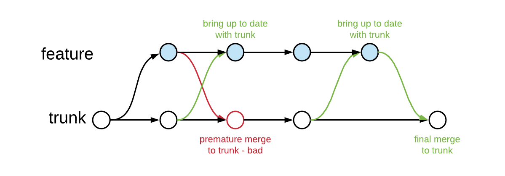
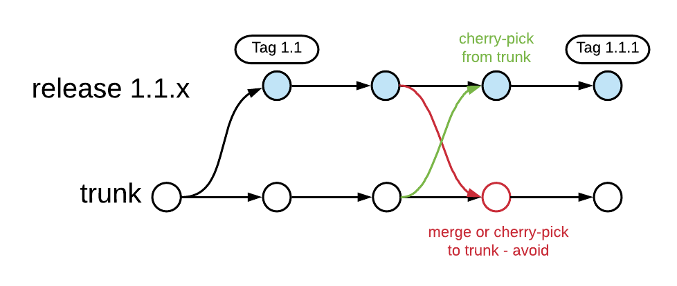
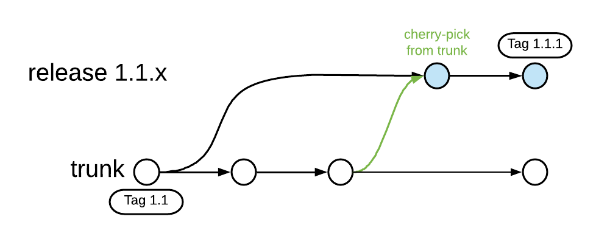

# Trunk Based Development

## Contents

-   [What is Trunk Based Development?](#what-is-trunk-based-development)
-   [Trunk Based Development advantages](#trunk-based-development-advantages)
    -   [Reducing distance between developers](#reducing-distance-between-developers)
    -   [Commitment to quality of code and build process](#commitment-to-quality-of-code-and-build-process)
    -   [Flexibility to refactor where needed](#flexibility-to-refactor-where-needed)
    -   [Encouraging incremental development](#encouraging-incremental-development)
    -   [Flexibility regarding releases](#flexibility-regarding-releases)
-   [Commits and reviewing](#commits-and-reviewing)
    -   [Committing straight to the trunk](#committing-straight-to-the-trunk)
    -   [Short-lived feature branches for review](#short-lived-feature-branches-for-review)
    -   [Review after the fact](#review-after-the-fact)
-   [Trunk Based Development and Continuous Integration](#trunk-based-development-and-continuous-integration)
-   [Trunk Based Development and Continuous Delivery/Deployment](#trunk-based-development-and-continuous-deliverydeployment)
-   [Releases](#releases)
    -   [Branching for release](#branching-for-release)
    -   [Releasing straight from trunk](#releasing-straight-from-trunk)
    -   [Creating a release branch only when needed](#creating-a-release-branch-only-when-needed)
-   [Dealing with larger changes](#dealing-with-larger-changes)
-   [Some good practices when applying Trunk Based Development](#some-good-practices-when-applying-trunk-based-development)
-   [Resources](#resources)

## What is Trunk Based Development?

-   Collaboration between developers happens through regular commits to a single branch, the “trunk” (ideally, several commits per developer per day)
-   Developers strive to keep the code in the trunk working at all times (builds, passes tests, etc.). Every commit on the trunk should be releasable without much additional effort.
-   Developers either commit directly to the trunk or commit to short-lived feature branches that are merged into the trunk after successful review
-   If used, feature branches don’t last more than a few days max and only a single developer (or pair of developers) commits to a single feature branch
-   Releasing happens either directly from the trunk (tagging a commit) or from release branches branched off of the trunk

## Trunk Based Development advantages

### Reducing distance between developers

Problem with long-lived feature branches: distance between developers!

-   One or more developers can work in separation from the rest of the team for days, weeks, or even months
-   Being able to work in isolation from the rest of the team can seem like a blessing. However, someday, your code will have to be integrated with the rest of the codebase.
-   The more pain you avoided (or should I say postponed) by choosing not to adjust to changes others were making, the more pain you are saving up until the time has come to merge your feature branch.

Why we should still be afraid of big merges, regardless of how good source control systems get at merging:

-   There will alway be cases where source control systems cannot perform the merge automatically. These merge conflicts need to resolve manually, and this becomes more and more difficult as the scope of the merge increases.
-   Even worse than this are the conflicts that your source control system does _not_ pick up on. These conflicts are called [semantic conflicts](https://martinfowler.com/bliki/SemanticConflict.html). The merge seems successful, but the code will either fail to compile, fail to run or (most dangerous case) succeed to run but produce incorrect results.

Some examples of semantic conflicts:

-   I rename a method, letting my IDE help me to change its name everywhere it is used. Meanwhile, you create some new code that calls the method (by its old name). Note that this will trigger compiler errors once we merge our code (if using a statically typed language), unless there is now another method with the old name and same signature that does something else than the renamed method (more dangerous).
-   There is a method that has a certain side effect. I decide to split out the side effect into a separate method, potentially because I have a new case where it is not needed. Then, I make sure to update all existing calls to the method to call the method for the side effect separately. Meanwhile, you write some new code calling the original method and expecting the side effect. The compiler doesn’t detect anything once we merge our code, we can only hope our tests will.
-   I change an abstraction while you build some code on top of the original abstraction. This one will probably trigger some compiler errors once we merge (if our language is statically typed), but could require you to completely change your approach.

Even if you frequently rebase your feature branch from the main development branch, other people won't see your changes until you merge your feature branch (and you're also not seeing other people's work that they haven't merged yet). 

If developers collaborate on a single branch, these types of issues are less likely to occur because developers try to stay up to date with the trunk and analyze if any changes made by other developers affect them. Additionally, developers can see if any changes they are making conflict with the path that others are taking (instead of turning their life into merge hell without realizing it). And, if semantic conflicts do occur, Trunk Based Development will make sure they are detected sooner rather than later, making them much easier to solve.

### Commitment to quality of code and build process

The fact that the team strives to keep the code in the trunk working at all times automatically means a dedication to the quality of code and the build process.

-   More communication regarding changes, especially if they are likely to affect other developers. 
-   Dedication to working code in the trunk means that there is a high bar for code changes and typically also some kind of reviewing process. Developers are typically also more careful with their changes if they know they immediately affect the entire team.
-   Keeping the code in the trunk working also means there is a strong incentive to set up a good build process that performs as many automated checks as possible to make sure the code actually does work. Developers should also run this build process locally in order to make sure their changes work _before_ actually pushing their code.

This part also highlights a possible challenge: Trunk Based Development does require a certain level of dedication to quality from everyone in the team and the team needs to be able to self-police if necessary.

### Flexibility to refactor where needed

In teams where work happens on long-lived feature branches, refactoring could turn an already challenging merge into a complete disaster. The thought of a painful merge can actually keep the team from applying the refactoring that the codebase needs. When practicing Trunk Based Development, the reduced distance between developers makes refactoring a lot easier, meaning that developers are more likely to do it when it makes sense.

### Encouraging incremental development

Trunk-Based Development forces you to divide your work into small pieces that don't break the rest of the codebase. Each of those steps is less risky than taking a giant step at once, plus you will get faster feedback if something went wrong.

### Flexibility regarding releases

In principle, every commit on the trunk should be a working version of the software, very close to being releasable. This means that Trunk Based Development provides a lot of flexibility regarding when and what to release.

## Commits and reviewing

### Committing straight to the trunk

-   Especially useful for smaller teams
-   Typically some kind of review (on top of the automated build process that developers can run on their machines as well)
    -   If the team uses pair programming, a pair is often allowed to commit directly to the trunk
    -   Synchronous review also possible

### Short-lived feature branches for review

Trunk Based Development allow feature branches as a tool for code review, with some restrictions:

-   Feature branches are short-lived (shorter is better, definitely not more than a few days)
-   Only one developer commits to a given feature branch.
-   Feature branches branch from the trunk and can only be merged to the trunk.
-   Merging from the feature branch to trunk is allowed only once and also means the end of the feature branch
-   Merging from trunk to bring the feature branch up to date with new changes is allowed anytime. It is especially recommended to bring your feature branch fully up to date with the trunk (and check that it builds) before actually merging into trunk

Pull requests (as offered by GitHub and Bitbucket) are a good way to handle this, and they make it easy to delete the branch when you merge it.

As feature branches are an alternative to committing directly to the trunk, the scope of a feature branch should be small enough to have been the scope for a single commit to trunk. However, it sometimes makes sense to split the work into separate commits to make the reviewing process easier. An example is having a separate commit with some refactoring and then another commit with the implementation of new functionality.

When merging a feature branch back to the trunk, it could make sense to perform a squash merge that makes the changes appear as a single commit on the trunk. Note, however, that this means losing information regarding the individual commits in the feature branch. Sometimes, it's better to keep the individual commits in a pull request for future reference.

### Review after the fact

As it is the team’s responsibility to keep the code in the trunk working, team members may choose to review commits that were pushed to the trunk. In case of any issues, the team can quickly coordinate on how to fix them.

## Trunk Based Development and Continuous Integration

Depending on who you ask, Continuous Integration can mean two things:

-   Developers very regularly integrate their changes into a single place where changes from all developers come together, making sure that they are of sufficient quality before doing so. 
    -   You could argue this was the initially intended meaning of Continuous Integration, and it is more or less the same as the main premise of Trunk Based Development.
-   There is some kind of process that watches the source control repository for changes and runs new commits through the build process (including tests etc.), alerting the team if the build does not pass.
    -   Very useful to have when practicing Trunk Based Development
    -   If it somehow occurs that the code in the trunk does not build, the team can take action immediately
        -   Note that this should in principle never happen, as developers should run the same build process locally before pushing their code
    -   This kind of automated build is also useful to have on feature branches and can be one of the deciding factors in the decision to merge. 
        -   For checking commits on feature branches, it is important that the branches are sufficiently up to date with the trunk. This is especially the case right before merging

## Trunk Based Development and Continuous Delivery/Deployment

-   _Continuous Delivery_: Commits that build successfully are automatically deployed to a quality assurance or acceptance testing environment.
    -   You will likely need several QA/UAT environments, each with different rules regarding frequency of deployment. Some of them might even temporarily be "reserved" for various reasons.
-   _Continuous Deployment_: Commits that build successfully are actually pushed all the way to production.
    -   Some large tech companies are doing this
    -   Note that this requires very extensive checking as part of the build process, as well as the use of techniques like [Feature flags](./Feature-flags.md) to gain control over the extent to which new features are turned on in production

## Releases

### Branching for release

-   The decision is made to release a state of the trunk
-   A release branch is created, starting from the commit representing that state of the trunk
-   Potentially, some very limited work happens in the release branch in order to fully make it release-ready
-   The code is released and the released commit is tagged

Bugfixes on a release:

-   Fix the bugs on the trunk and cherry-pick them into the release branch, and not the other way around!
    -   This helps prevent regression bugs caused by applying a fix in a release branch but forgetting to apply the fix on the trunk as well. 
    -   Exceptions are only allowed if it is really not possible to reproduce the bug on the trunk.
-   The code is released and the released commit is tagged

### Releasing straight from trunk

-   Release straight from the trunk, without creating a new release branch. 
-   Doable if commits on the trunk are really release-ready
-   Often even no real version numbers. Instead, commit identifiers can be used.
-   Seen in teams that release very often
-   What if release contains bugs?
    -   Typically a fix-forward strategy where team fixes the bug on trunk as soon as possible and then push a new release including the fix

### Creating a release branch only when needed

-   Start by releasing directly from trunk, tagging the commit with a release number
-   If a bug exists in the release, a release branch is retroactively created from that commit (modern source control systems allow this) and fixes can be cherry-picked into that branch

This is what this looks like when releasing version 1.1 directly from the trunk:

Then, if a fix is needed for the release, a branch is created retroactively from the release commit.

## Dealing with larger changes

-   In principle, every commit in the trunk should be releasable. 
-   When introducing new features or performing other large changes, it is often not feasible to make all of the changes in a single commit of reasonable size (and smaller commits are seen as better). 
    -   We need some strategies that can be used to spread out changes while keeping each commit potentially releasable.

Strategies:

-   [Feature flags](Feature-flags.md)
-   [Branch by Abstraction and application strangulation](Branch-by-abstraction-application-strangulation.md)

## Some good practices when applying Trunk Based Development

-   _Quick reviews_: Developers try to get their code reviewed as soon as possible.
-   _Chasing HEAD_: Developers try to stay up to date with changes to the trunk.
-   _Shared nothing_: Developers run the build locally before pushing their code, typically including integration and functional tests talking to real databases etc. This means individual developers must be able to run the application and all its dependencies locally, without depending on resources shared with others.
    -   Small teams could even survive without a CI server for quite some time if every developer runs the build locally before committing
    -   A problem with testing locally is that the environment on which the tests are run is likely quite different from the production environment. Therefore, you will likely still need several QA/UAT environments. These environments will ideally contain real instances of services and applications that your system integrates with, but those will ideally not be shared between the different environments.
-   _Facilitating commits_: Developers sometimes chop up their work into multiple smaller commits in order to make their changes easier for their teammates to adjust to.
    -   Example: When building a feature entails introducing a new dependency, this dependency could be introduced separately through a new commit that the developer explicitly notifies the team of
    -   Example: First create and commit interfaces, then work on implementation while others can already code against the interfaces
-   _Thin Vertical Slices_: Stories or tasks from the backlog can ideally be implemented completely by a single developer or pair of developers in a short amount of time and small number of commits. They cut across the whole stack and they do not need to be passed around between developers with specialized knowledge in order to get completed.

## Resources

-   [Trunk Based Development](https://trunkbaseddevelopment.com/)
-   [Long-Running Branches Considered Harmful](https://blog.newrelic.com/culture/long-running-branches-considered-harmful/)
-   [Why Code Reviews Hurt Your Code Quality and Team Productivity](https://simpleprogrammer.com/code-review-trunk-based-development/)
-   [SemanticConflict](https://martinfowler.com/bliki/SemanticConflict.html)
-   [Feature Toggles (aka Feature Flags)](https://martinfowler.com/articles/feature-toggles.html)
-   [Branch By Abstraction](https://www.branchbyabstraction.com/)
