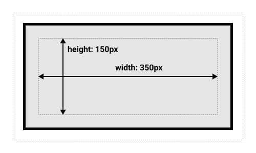
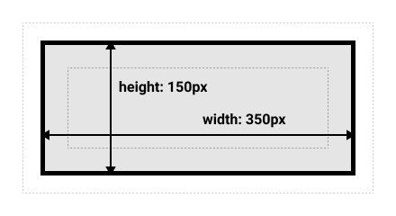

# Box model

See:

- [CSS - The Complete Guide 2020 (incl. Flexbox, Grid & Sass)](https://www.udemy.com/course/css-the-complete-guide-incl-flexbox-grid-sass/)
- [The box model](https://developer.mozilla.org/en-US/docs/Learn/CSS/Building_blocks/The_box_model)
- [Normal Flow](https://developer.mozilla.org/en-US/docs/Learn/CSS/CSS_layout/Normal_Flow)

## Blocks and inline boxes

- Basically, every element in a page has a box drawn around it. 
- This box influences the space the element takes and how it interacts with other elements.

Generally speaking, CSS has two types of boxes:

- Block boxes
- Inline boxes

### Block boxes

Behavior:

- Extend horizontally to fill the space available in its parent/container
- Each box is shown on a new line
- The `width` and `height` properties are respected
- Padding, margins and borders will push other elements away

Elements that are displayed as block boxes by default: 

- Headings
- Paragraphs (`<p>`)
- Divs (`<div>`)
- ...

### Inline boxes

Behavior:

- Extend to fit their content
- Do not create a line break unless they do not fit on the current line
- The `width` and `height` properties do not apply
- Padding, margins and borders will apply but will not push other inline boxes away

Elements that are displayed as inline boxes by default:

- Links (`<a>`)
- Spans (`<span>`)
- ...

## Inner and outer display types

CSS boxes have both **inner** and **outer** display types

Outer display type:

- Block
- Inline

Inner display type specifies how elements *inside* the box are laid out:

- Default: normal flow, direct children of the box behave just like other block and inline elements
- Flexbox: direct children of the box will be laid out using the Flexbox spec
- Grid: direct children of the box will be laid out using the Grid spec

## Changing display types

See: [display](https://developer.mozilla.org/en-US/docs/Web/CSS/display)

You can change an element's inner and outer display type using the `display` property

Examples:

- `display: block;` gives the element an outer display type of block and default inner display type
- `display: inline;` gives the element an outer display type of inline and default inner display type
- `display: flex;` gives the element an outer display type of block and inner display type Flexbox
- `display: grid;` gives the element an outer display type of block and inner display type Grid
- `display: inline-flex;` gives the element an outer display type of inline and inner display type Flexbox
- `display: inline-grid;` gives the element an outer display type of block and inner display type Grid

Note: one single value specifies both the outer and inner display type. There is a new CSS specification that allow specifying two values for the `display` property - one for outer and one for inner display type - but support for this is limited at the moment.

## The CSS box model

- Defines how the content of a box plus the box's margin, border and padding influence the box that your see on the page
- Applies fully to block boxes
- Applies partially to inline boxes

### Box building blocks

- **Content box:** the area displaying the actual content
- **Padding box:** the padding is the white space around the content
- **Border box:** the border sits around the content and padding
- **Margin box:** the margin is the outer layer, sitting around the border

### The two box models

Things are slightly complicated by CSS having two box models that differ in the way they calculate an element's dimensions

#### The standard CSS box model

With and height of an element define the width and height of the *content box*



([image source](https://developer.mozilla.org/en-US/docs/Learn/CSS/Building_blocks/The_box_model))

The padding and the border are then added to this to determine the total size taken up by the box (margins are seen as space *between* boxes, see later)

#### The alternate CSS box model

Width and height of an element include the padding and the border (and thus, the total size taken up by the box)



([image source](https://developer.mozilla.org/en-US/docs/Learn/CSS/Building_blocks/The_box_model))

This was introduced later on because the standard box model was seen as inconvenient to work with.

It is common to set the alternate box model as default for all elements, either through a CSS reset stylesheet or manually using something like this:

```css
html {
    box-sizing: border-box;
}

*, *::before, *::after {
    box-sizing: inherit;
}
```

## Margins, padding and borders

### Margins

- Define the space *around* the element's box. They do not affect the size of the box, but they do affect the space *between* boxes
- Can also be **negative**, making boxes overlap
- Can be set using the `margin` property or individually for each side using the `margin-top`, `margin-right`, `margin-bottom` and  `margin-left` properties

#### Margin collapsing

If the margins for two elements touch, these margins will be combined (collapsed) to become one margin, which is the size of the largest margin of the two

Reasoning: if two boxes are next to each other, one of those boxes needs 50px around, and the other one needs 40px around it, then separating the boxes by 50px satisfies this

There are some specific rules and special cases here, see [Mastering margin collapsing](https://developer.mozilla.org/en-US/docs/Web/CSS/CSS_Box_Model/Mastering_margin_collapsing)

In order to avoid confusion caused by margin collapsing, it can help to choose specific sides where you apply margins. For example, for vertical spacing between boxes, you could choose to only use `margin-top` and not `margin-bottom`

### Borders

Note: borders are part of the total size of the box

### Padding

- Sits between the border and the content area
- Cannot be negative (unlike margins)

## The box model and inline boxes

For inline boxes:

- `width` and `height` properties are ignored
- Padding and border are respected, but might overlap other content because of the behavior with margins
- Top and bottom margins are ignored
- Left and right margins are respected

## Inline blocks (`display: inline-block`)

- Special case that sits in the middle between inline and block
- Respects `width` and `height` properties
- Margin causes other elements to be pushed away
- Can sit in line with other elements
- Only takes up space needed by content (unless `width` or`height` properties are set)

## Sizing elements

- Setting `width` or `height` has different effect depending on which box model is used (see above)
- Can also use things like `min-width` and `max-width` to provide boundaries for an element's size
- Setting width and height relative to parent: use `%`
  - Note: using this to set the height of an element (for example `height: 100%;`) only works if the parent has an actual defined height
  - Flexbox or grid could be a good alternative here
- Setting width and height relative to viewport (portion of the screen that the browser uses to show the page): use `vh`

## Hiding elements

- `display: none;`: Remove the element from the document flow, which means that it will not take up any space and other elements can take its place
-  `visibility: hidden;`: Hide the element, but still let it take up space (and thus push away other elements as necessary)

