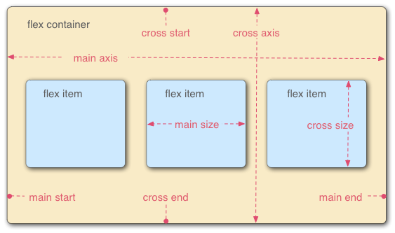

# Flexbox (CSS)

## Contents

-   [Basic idea](#basic-idea)
-   [Sizing of flex items](#sizing-of-flex-items)
-   [Alignment of flex items](#alignment-of-flex-items)
-   [Wrapping](#wrapping)
-   [Use cases](#use-cases)
-   [Resources](#resources)

## Basic idea

([image source](https://developer.mozilla.org/en-US/docs/Learn/CSS/CSS_layout/Flexbox))

-   **Flex container** = parent element with `display: flex`
-   Children of container = **flex items** (their size and position is determined by flexbox)
-   **Main axis**  = direction in which the chldren of the container are laid out
    -   Horizontal if container has `flex-direction: row;`
    -   Vertical if container has `flex-direction: column;`
-   **Cross axis** = direction perpendicular to main axis
-   Note: Flexbox is mainly suitable when you want your items to adjust their sizes to their container along a single direction (either horizontally or vertically). If both horizontal and vertical sizing is important to you, [Grids](./Grids.md) may be a better option.

## Sizing of flex items

You can control the sizing of flex items along the main axis by setting their `flex` property (see [flex](https://developer.mozilla.org/en-US/docs/Web/CSS/flex) for a bit more details)

The `flex` property can have up to 3 values:

-   Flex grow: a unitless proportion that indicates the extent to which the item will grow with its container
-   Flex shrink: a unitless proportion that indicates the extent to which the item will shrink (if needed) to fit the container
-   Flex basis: the minimum size of the item

## Alignment of flex items

Alignment along the main axis: [justify-content](https://developer.mozilla.org/en-US/docs/Web/CSS/justify-content) (set at the level of the container)

-   `flex-start` (default): make items sit towards the start of the main axis
-   `flex-end`: make items sit towards the endof the main axis
-   `center`: make items sit towards the center of the main axis
-   `space-around`: evenly distribute items (same amount of spacing between adjacent items) and leave half of that spacing at the start and end of the main axis
-   `space-between`: evenly distribute items (same amount of spacing between adjacent items), without any spacing at the start and end of the main axis
    -   Simple use case: two elements, one sticking to the left side of the container and one sticking to the right side of the container

Alingment along the cross axis: [align-items](https://developer.mozilla.org/en-US/docs/Web/CSS/align-items) (set at the level of the container, can override at the item level using [align-self](https://developer.mozilla.org/en-US/docs/Web/CSS/align-self))

-   `stretch` (default): make items fill the parent along the cross axis
-   `center`: center items along the cross axis
-   `flex-start` or `flex-end`: start or end of cross axis

## Wrapping

You can make your items wrap to a new row/column as necessary using `flex-wrap: wrap;` on the container

## Use cases

Some use cases for Flexbox:

-   Vertical centering
-   Sticky footer (sticks to bottom of screen if content doesn't fill screen)
-   Make an element take up all of the vertical space that is not yet taken up by other elements
-   Make the children of a container scale along with the size of the container
-   Show the children of a container side-by-side and make them have the same height, even if their content doesn't take up the same height

## Resources

-   [CSS - The Complete Guide 2020 (incl. Flexbox, Grid & Sass)](https://www.udemy.com/course/css-the-complete-guide-incl-flexbox-grid-sass/)
-   [Flexbox](https://developer.mozilla.org/en-US/docs/Learn/CSS/CSS_layout/Flexbox)
-   [flex](https://developer.mozilla.org/en-US/docs/Web/CSS/flex)
-   [Solved by Flexbox](https://philipwalton.github.io/solved-by-flexbox/)
