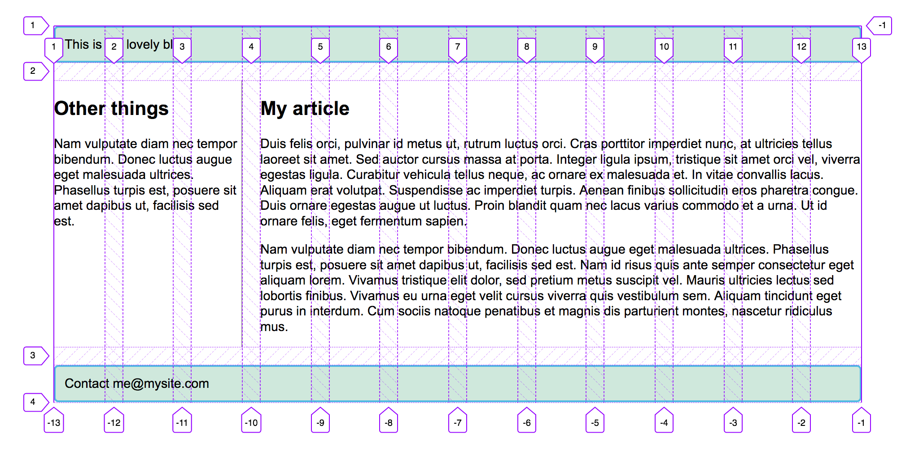
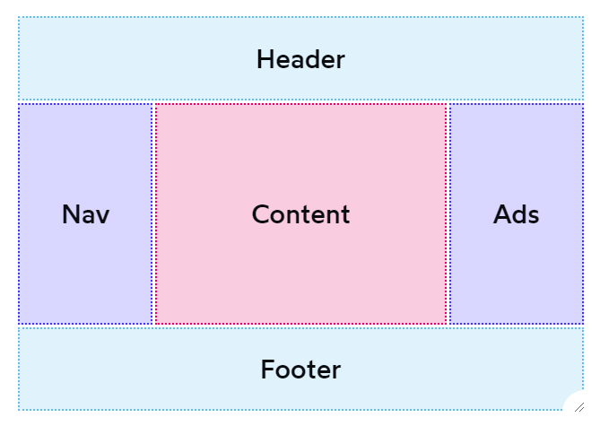
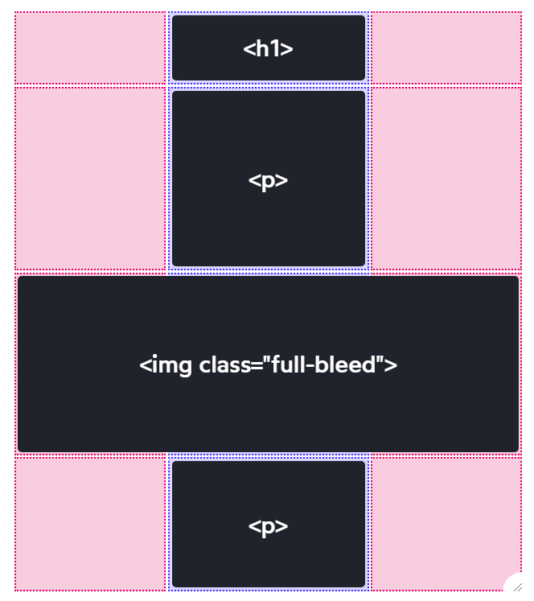

# Grids (CSS)

## Contents

-   [Basic idea](#basic-idea)
-   [Use cases](#use-cases)
    -   [Holy grail layout](#holy-grail-layout)
    -   [Full bleed layout](#full-bleed-layout)
-   [Resources](#resources)

## Basic idea

([image source](https://developer.mozilla.org/en-US/docs/Learn/CSS/CSS_layout/Grids))

-   Grid with horizontal **rows** and vertical **columns**
    -   Row height and column width can be different per row/column
-   Gaps between each row and between each column called **gutters**

Grid is enabled at the level of the container by setting `display: grid;` on it

## Use cases

Grids are a good option whenever you want to define a two-dimensional layout for your page.

Example (with indication of rows and columns as shown by [Firefox Grid Inspector](https://developer.mozilla.org/en-US/docs/Tools/Page_Inspector/How_to/Examine_grid_layouts)):

([image source](https://developer.mozilla.org/en-US/docs/Learn/CSS/CSS_layout/Grids))

### Holy grail layout

([image source](https://www.joshwcomeau.com/css/full-bleed/))

Simple way to achieve it: [CSS Grid: Holy Grail Layout](https://www.digitalocean.com/community/tutorials/css-css-grid-holy-grail-layout)

### Full bleed layout

([image source](https://www.joshwcomeau.com/css/full-bleed/))

How to achieve it: [Full-Bleed Layout Using CSS Grid](https://www.joshwcomeau.com/css/full-bleed/)

## Resources

-   [CSS - The Complete Guide 2020 (incl. Flexbox, Grid & Sass)](https://www.udemy.com/course/css-the-complete-guide-incl-flexbox-grid-sass/)
-   [Grids](https://developer.mozilla.org/en-US/docs/Learn/CSS/CSS_layout/Grids)
-   [CSS Grid: Holy Grail Layout](https://www.digitalocean.com/community/tutorials/css-css-grid-holy-grail-layout)
-   [Full-Bleed Layout Using CSS Grid](https://www.joshwcomeau.com/css/full-bleed/)
